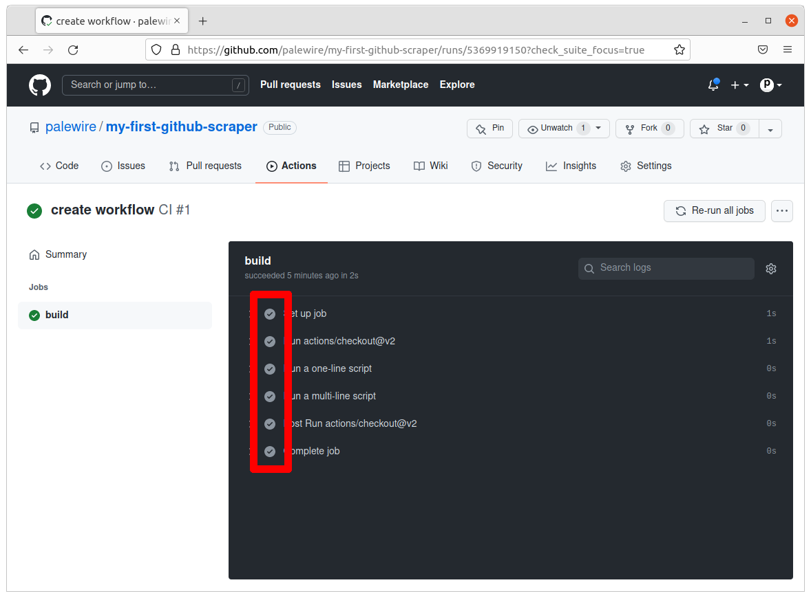
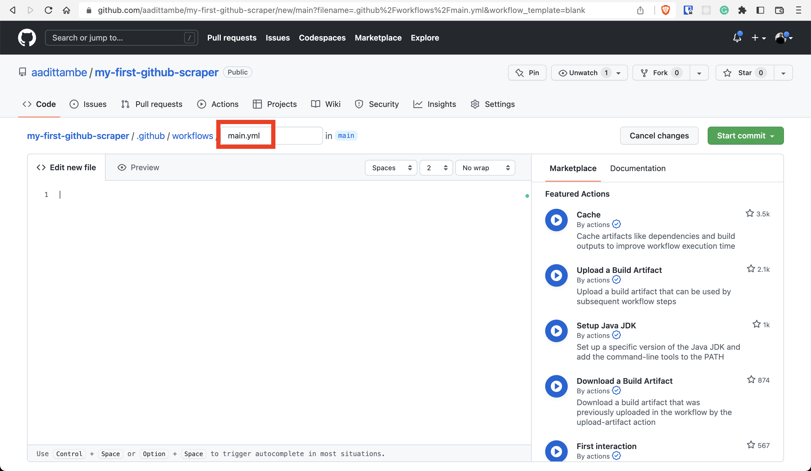

```{include} _templates/nav.html
```

# Run via GitHub Actions

This chapter will walk you through how to create a GitHub Action that executes a scraper on a schedule.

```{contents} Sections
  :depth: 1
  :local:
```

## Create a generic Action

Navigate back to the GitHub repo and click on the Actions tab.


This page will display a log of the Action we configure.


Let's start by running a simple workflow as a test. In the "Simple workflow," click the "Configure" button

  

Let's rename this workflow file `test.yml`, like so:

  

Without changing anything, push the green "Start commit" button.


When a popup appears, write a commit message like "create workflow" and commit the file to your repository but hitting the green button at the bottom.


After you commit, you will be navigated back to your repository’s Code tab. Note that a directory `.github` was created at the root. Inside it you will find a `workflows` directory with your action.


## Understand the generic Action

Navigate back to the "Actions" tab.


Notice that it logged the first run of the template workflow you just created. 
<!-- 
  OUTDATED IMG-->

Click on "create workflow" next to the green check.


Click on "build" to dig into our Action’s activity.


The check mark next to each step indicates that the step within the build job was successfully executed.



The name of the workflow is "CI." This is an optional name given to the workflow and it appears in the Actions tab of the GitHub repository. It is defined by this line of the workflow file.

```{code-block} yaml
:emphasize-lines: 3
# This is a basic workflow to help you get started with Actions

name: CI

# Controls when the workflow will run
on:
  # Triggers the workflow on push or pull request events but only for the main branch
  push:
    branches: [ main ]
  pull_request:
    branches: [ main ]

  # Allows you to run this workflow manually from the Actions tab
  workflow_dispatch:

# A workflow run is made up of one or more jobs that can run sequentially or in parallel
jobs:
  # This workflow contains a single job called "build"
  build:
    # The type of runner that the job will run on
    runs-on: ubuntu-latest

    # Steps represent a sequence of tasks that will be executed as part of the job
    steps:
      # Checks-out your repository under $GITHUB_WORKSPACE, so your job can access it
      - uses: actions/checkout@v2

      # Runs a single command using the runners shell
      - name: Run a one-line script
        run: echo Hello, world!

      # Runs a set of commands using the runners shell
      - name: Run a multi-line script
        run: |
          echo Add other actions to build,
          echo test, and deploy your project.
```

This Action is triggered when there is a "pull" or a "push" to the repository's `main` branch. This Action just ran when we pushed our commit to the repository. These events are defined by this portion in the workflow. 

```{code-block} yaml
:emphasize-lines: 6-11
# This is a basic workflow to help you get started with Actions

name: CI

# Controls when the workflow will run
on:
  # Triggers the workflow on push or pull request events but only for the main branch
  push:
    branches: [ main ]
  pull_request:
    branches: [ main ]

  # Allows you to run this workflow manually from the Actions tab
  workflow_dispatch:

# A workflow run is made up of one or more jobs that can run sequentially or in parallel
jobs:
  # This workflow contains a single job called "build"
  build:
    # The type of runner that the job will run on
    runs-on: ubuntu-latest

    # Steps represent a sequence of tasks that will be executed as part of the job
    steps:
      # Checks-out your repository under $GITHUB_WORKSPACE, so your job can access it
      - uses: actions/checkout@v2

      # Runs a single command using the runners shell
      - name: Run a one-line script
        run: echo Hello, world!

      # Runs a set of commands using the runners shell
      - name: Run a multi-line script
        run: |
          echo Add other actions to build,
          echo test, and deploy your project.
```

This workflow can be run manually by a user from the Actions tab in GitHub. This is defined by the following line in the workflow file.

```{code-block} yaml
:emphasize-lines: 14
# This is a basic workflow to help you get started with Actions

name: CI

# Controls when the workflow will run
on:
  # Triggers the workflow on push or pull request events but only for the main branch
  push:
    branches: [ main ]
  pull_request:
    branches: [ main ]

  # Allows you to run this workflow manually from the Actions tab
  workflow_dispatch:

# A workflow run is made up of one or more jobs that can run sequentially or in parallel
jobs:
  # This workflow contains a single job called "build"
  build:
    # The type of runner that the job will run on
    runs-on: ubuntu-latest

    # Steps represent a sequence of tasks that will be executed as part of the job
    steps:
      # Checks-out your repository under $GITHUB_WORKSPACE, so your job can access it
      - uses: actions/checkout@v2

      # Runs a single command using the runners shell
      - name: Run a one-line script
        run: echo Hello, world!

      # Runs a set of commands using the runners shell
      - name: Run a multi-line script
        run: |
          echo Add other actions to build,
          echo test, and deploy your project.
```

The first step in the workflow — "Set up job" — gives the "job" a name, "build". This step also configures the job to run on the latest version of an Ubuntu Linux runner, hosted by GitHub. This was defined by this portion of the workflow file.

```{code-block} yaml
:emphasize-lines: 17-21
# This is a basic workflow to help you get started with Actions

name: CI

# Controls when the workflow will run
on:
  # Triggers the workflow on push or pull request events but only for the main branch
  push:
    branches: [ main ]
  pull_request:
    branches: [ main ]

  # Allows you to run this workflow manually from the Actions tab
  workflow_dispatch:

# A workflow run is made up of one or more jobs that can run sequentially or in parallel
jobs:
  # This workflow contains a single job called "build"
  build:
    # The type of runner that the job will run on
    runs-on: ubuntu-latest

    # Steps represent a sequence of tasks that will be executed as part of the job
    steps:
      # Checks-out your repository under $GITHUB_WORKSPACE, so your job can access it
      - uses: actions/checkout@v2

      # Runs a single command using the runners shell
      - name: Run a one-line script
        run: echo Hello, world!

      # Runs a set of commands using the runners shell
      - name: Run a multi-line script
        run: |
          echo Add other actions to build,
          echo test, and deploy your project.
```

The second step, "Run actions/checkout@v2," specified that this step ran v2 of the actions/checkout action. We need to use the checkout action any time our workflow file runs agains the repository's code. This was defined by this portion of the workflow file.

```{code-block} yaml
:emphasize-lines: 24-26
# This is a basic workflow to help you get started with Actions

name: CI

# Controls when the workflow will run
on:
  # Triggers the workflow on push or pull request events but only for the main branch
  push:
    branches: [ main ]
  pull_request:
    branches: [ main ]

  # Allows you to run this workflow manually from the Actions tab
  workflow_dispatch:

# A workflow run is made up of one or more jobs that can run sequentially or in parallel
jobs:
  # This workflow contains a single job called "build"
  build:
    # The type of runner that the job will run on
    runs-on: ubuntu-latest

    # Steps represent a sequence of tasks that will be executed as part of the job
    steps:
      # Checks-out your repository under $GITHUB_WORKSPACE, so your job can access it
      - uses: actions/checkout@v2

      # Runs a single command using the runners shell
      - name: Run a one-line script
        run: echo Hello, world!

      # Runs a set of commands using the runners shell
      - name: Run a multi-line script
        run: |
          echo Add other actions to build,
          echo test, and deploy your project.
```

The third step, “Run a one-line script,” prints a simple string "Hello, world!" and the fourth step, "Run a multi-line script" prints two lines: "Add other actions to build," and "test, and deploy your project" using the `echo` command. `echo` in linux is used to [display a line of text or string](https://www.shellscript.sh/echo.html) that is passed following the command.

```{code-block} yaml
:emphasize-lines: 28-36
# This is a basic workflow to help you get started with Actions

name: CI

# Controls when the workflow will run
on:
  # Triggers the workflow on push or pull request events but only for the main branch
  push:
    branches: [ main ]
  pull_request:
    branches: [ main ]

  # Allows you to run this workflow manually from the Actions tab
  workflow_dispatch:

# A workflow run is made up of one or more jobs that can run sequentially or in parallel
jobs:
  # This workflow contains a single job called "build"
  build:
    # The type of runner that the job will run on
    runs-on: ubuntu-latest

    # Steps represent a sequence of tasks that will be executed as part of the job
    steps:
      # Checks-out your repository under $GITHUB_WORKSPACE, so your job can access it
      - uses: actions/checkout@v2

      # Runs a single command using the runners shell
      - name: Run a one-line script
        run: echo Hello, world!

      # Runs a set of commands using the runners shell
      - name: Run a multi-line script
        run: |
          echo Add other actions to build,
          echo test, and deploy your project.
```

## Customize the workflow (with `pip` and Google Collab)

<!-- CREATE NEW BLANK WORKFLOW TO START WIRTING NEW ACTION FILE  -->

Now, we'll create a similar workflow to trigger the run of our scraper at a particular interval.

Let's go back to the "Actions" tab. Notice that our last Action's run is logged here. Click the "New workflow" button to build another workflow.


This time, we will create a workflow from scratch to run our scraper. Click on the blue link that says, "set up a workflow yourself."


This time, we will call our `yml` file, `main.yml`.




GitHub Actions uses YAML syntax to define the workflow. These workflows are stored in the repository, in a hidden directory (denoted by the `.` in front of it) called `.github/workflows`.

We will start by giving our workflow a `name` — something like "Scrape."

```{code-block} yaml
name: Scrape
```

Next, we will add settings in the workflow so that the Action runs on a schedule — instead of running on `push`, like in our first test. We will use the `on` keyword.

```{code-block} yaml
:emphasize-lines: 3-6
name: Scrape

on:
  schedule:
    - cron: "0 8 * * *" # 8 a.m. every day UTC
  workflow_dispatch:
```
This will tell our workflow to execute on a schedule, at 9 a.m. UTC every day.

```{note}
We will schedule the Action using [Cron](https://en.wikipedia.org/wiki/Cron), a time-based job scheduler that the computer uses to execute commands. There are websites — such as [this one](https://crontab.guru/) — that help translate time into cron schedule expressions. GitHub runs Actions in coordinated universal time (UTC).
```

Now let's tell the workflow what tasks — using the `jobs` keyword — to execute. Let's call this job `scrape`.

```{code-block} yaml
:emphasize-lines: 8-9
name: Scrape

on:
  schedule:
    - cron: "0 8 * * *" # 8 a.m. every day UTC
  workflow_dispatch:

jobs:
  scrape:
```

We will use the `runs-on` keyword to tell GitHub what runner the job will use.

```{note}
A [runner](https://docs.github.com/en/actions/using-github-hosted-runners/about-github-hosted-runners) is a virtual machine hosted by GitHub with the GitHub Actions application. GitHub offers runners with Linux, Windows, and macOS operating systems.
```

In our case, the runner will be the latest version of Ubuntu, an open-source operating system on Linux.

```{code-block} yaml
:emphasize-lines: 10
name: Scrape

on:
  schedule:
    - cron: "0 8 * * *" # 8 a.m. every day UTC
  workflow_dispatch:

jobs:
  scrape:
    runs-on: ubuntu-latest
```

Using the `steps` keyword we will tell GitHub the sequence of tasks that we want the job to execute.

```{code-block} yaml
:emphasize-lines: 11
name: Scrape

on:
  schedule:
    - cron: "0 8 * * *" # 8 a.m. every day UTC
  workflow_dispatch:

jobs:
  scrape:
    runs-on: ubuntu-latest
    steps:
```

Next, we will tell the virtual machine that is hosting this Action to install Python 3, along with the libraries our scraper will use. 

The `name` keyword denotes the title we give the step.

The `uses` keyword specifies which version of the `actions/checkout` action to run. In our case, we will use `v2`.

The `run` keyword tells the job to execute a command on the runner.

```{note}
For those who are running scraper notebooks on collab or Jupyter Lab Desktop apps see below. If you are using your scraper locally with pipenv skip to next section
```

Remember the imports for the scraper, your actions file will need to direct GithubActions to install them. 

```{code-block} yaml
:emphasize-lines: 12-16
name: Scrape

on:
  schedule:
    - cron: "0 8 * * *" # 8 a.m. every day UTC
  workflow_dispatch:

jobs:
  scrape:
    runs-on: ubuntu-latest
    steps:
    - uses: actions/checkout@v2
    - uses: actions/setup-python@v2
      with:
        python-version: '3.9'
    - run: pip install notebook requests bs4
```

Now that we have all the requirements installed, let's run the code. Let's `name` this step `Run scraper` we will `run` the notebook using the `jupyter execute scrape.ipynb` command. 

```{code-block} yaml
:emphasize-lines: 17-18
name: Scrape

on:
  schedule:
    - cron: "0 8 * * *" # 8 a.m. every day UTC
  workflow_dispatch:

jobs:
  scrape:
    runs-on: ubuntu-latest
    steps:
    - uses: actions/checkout@v2
    - uses: actions/setup-python@v2
      with:
        python-version: '3.9'
    - run: pip install notebook requests bs4
    - name: Run scraper
      run: jupyter execute scrape.ipynb
```

Let's commit this workflow to our repository. 

Similar to how we committed our previous test workflow, let's click the green "Start commit." 

Write a message for this commit — something like "create workflow" — and press the green "Commit new file" button.


## Run the workflow manually

Let's test the workflow we created on GitHub. Navigate back to your repository on and click on the 'Actions' tab.


Click on "Scrape" under "All workflows."


Push the white "Run workflow" button.


Then the green "Run workflow" button to trigger the job.


Reload the page and your job will be running.


Within a minute or two, the job should complete. The yellow dot will turn green.


Congratulations, you’ve run a scraper in the cloud.

One problem: While GitHub was able to execute our scraper, we haven’t told it to commit the results back to the respository. The data you gathered isn't being saved anywhere. Yet.

## Optional: Customize workflow (Advanced, with `pipenv`)

<!-- ## Pull the workflow from GitHub

The next step is to pull the changes we made on GitHub to the local branch on your computer. Go back to terminal and enter the following command:

```
git pull origin main
```

Open the directory in a code editor and navigate to the workflow file we created called `main.yml` in the `.github/workflows` directory.

Select **everything** in the `main.yml` workflow file and **delete it**. We will write steps to iteratively build the workflow. 

CREATE A NEW BLANK WORKFLOW THIS TIME TO START WRITING NEW ACTION FILE FOR SCRAPING 
-->

```{note}
For those who running scraper locally with pipenv. 
```

```{code-block} yaml
:emphasize-lines: 12-19
name: Scrape

on:
  schedule:
    - cron: "0 8 * * *" # 8 a.m. every day UTC
  workflow_dispatch:

jobs:
  scrape:
    runs-on: ubuntu-latest
    steps:
    - uses: actions/checkout@v2
    - name: Install pipenv
      run: pipx install pipenv
    - uses: actions/setup-python@v2
      with:
        python-version: '3.9'
        cache: 'pipenv'
    - run: pipenv install --python `which python`
```

```{note}
GitHub has a detailed explanation of every keyword in the workflow on [this](https://docs.github.com/en/actions/learn-github-actions/understanding-github-actions#understanding-the-workflow-file) page.
```

Now that we have all the requirements installed, let's run the code. Let's `name` this step `Run scraper` we will `run` the notebook using the `pipenv jupyter execute scrape.ipynb` command. 

```{code-block} yaml
:emphasize-lines: 20-21
name: Scrape

on:
  schedule:
    - cron: "0 8 * * *" # 8 a.m. every day UTC
  workflow_dispatch:

jobs:
  scrape:
    runs-on: ubuntu-latest
    steps:
    - uses: actions/checkout@v2
    - name: Install pipenv
      run: pipx install pipenv
    - uses: actions/setup-python@v2
      with:
        python-version: '3.9'
        cache: 'pipenv'
    - run: pipenv install --python `which python`
    - name: Run scraper
      run: pipenv run jupyter execute scrape.ipynb
```