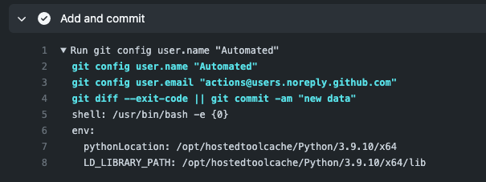

```{include} _templates/nav.html
```

# Saving the data and dealing with errors

This chapter will walk you through how to save the data in the repository, and spot and fix common errors.  

```{contents} Sections
  :depth: 1
  :local:
```

## Tell the Action to log the result

On your computer, navigate to the `main.yml` file in the `.github/workflows` directory. Open it in your code editor. 

We will add commands to this file to ask GitHub to save the results of the scraper. 

We will accomplish this by instructing the Action to `add`, `commit` and `push` changes after the scraper runs, so they will show up in our respository. This is very similar to the commands you would write to push local changes to GitHub the command line.

```
name: Scrape

on:
  schedule:
    - cron: "0 8 * * *" # 9 a.m. every day UTC
  workflow_dispatch:

jobs:
  scrape:
    runs-on: ubuntu-latest
    steps:
    - uses: actions/checkout@v2
    - name: Install pipenv
      run: pipx install pipenv
    - uses: actions/setup-python@v2
      with:
        python-version: '3.9'
        cache: 'pipenv'
    - run: pipenv install jupyter requests pandas beautifulsoup4	nbclient
    - name: Run scraper
      run: pipenv run jupyter execute scrape.ipynb
    - name: Add and commit	
      run: |-	
        git add --all	
        git config user.name "Automated"	
        git config user.email "actions@users.noreply.github.com"	
        git commit -m "Latest data" 	
    - name: Push	
      run: git push
```

## Commit your changes to GitHub

Save the YAML file and commit your changes to the GitHub repository.

```
git add --all
git commit -m "added steps to save results"
git push origin main
```

## Run the Action on GitHub (and watch it log the data!)

Navigate back to your respository on GitHub, and once again, click on the "Actions" tab. Then click on "Scrape" under "All workflows" and run the workflow. 


After the Action has run, go to the "Code" tab on GitHub, and notice a new `warn-data.csv` file logged to our repository.


```{note}
When the Action runs, it saves the data files to GitHub. The next time you want to make modifications to your code in the repository, you need to first pull the most recent changes from the remote branch on GitHub to your computer, before committing and pushing anymore changes. 

Use the `git fetch` and `git pull` commands from the command line.

```

## How to spot a failed fails

Let's go back to our action tab and run the action one more time.
A failed action looks like this:


Github will email you when your action fails. It can happen quite often!


To find out what went wrong with your action, click into your job. 


This action failed because there was nothing to commit when your scrape notebook `scrape.ipynb` ran for the second time. 
If the site you scrape updates sporadically, you may not care if there was a change in your file at every scrape. To fix this, you can replace the commit line with the following:

```bash
git diff --exit-code || git commit -am "adding new data"
``` 

This line will check to see if there are [any changes](https://git-scm.com/docs/git-diff#Documentation/git-diff.txt---exit-code), and only add and commit if there are changes. 

## Check your work

Run the action one more time and see if it fails. 



Now pull the repo back down to your local machine, and change a line in your `warn.csv`. 

Push up and run the action one more time. Check to make sure changes have been committed to your repo.


Remember, you may want your action to fail depending on your scrape. You can also design a custom message to be sent out to a slack channel. 


