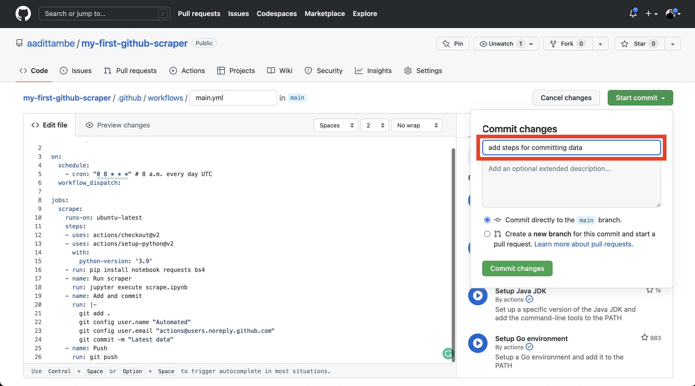

```{include} _templates/nav.html
```

# Saving the data

This chapter will walk you through how to save the data in the repository, and spot and fix common errors.  

```{contents} Sections
  :depth: 1
  :local:
```

## Log the result

In your repo, navigate to the `main.yml` file in the `.github/workflows` directory. 

Click the pencil icon on top of the file to edit it.


We will add commands to this file to ask GitHub to save the results of the scraper. 

We will accomplish this by instructing the Action to `add`, `commit` and `push` changes after the scraper runs, so they will show up in our respository. This is very similar to the commands you would write to push local changes on your computer to GitHub, either using GitHub Desktop or the command line.


```{code-block} bash
:emphasize-lines: 21-28
name: Scrape

on:
  schedule:
    - cron: "0 8 * * *" # 8 a.m. every day UTC
  workflow_dispatch:

jobs:
  scrape:
    runs-on: ubuntu-latest
    steps:
    - uses: actions/checkout@v2
    - uses: actions/setup-python@v2
      with:
        python-version: '3.9'
    - run: pip install notebook requests bs4
    
    - name: Run scraper
      run: jupyter execute scrape.ipynb
    
    - name: Add and commit	
      run: |
        git add .	
        git config user.name "Automated"	
        git config user.email "actions@users.noreply.github.com"	
        git commit -m "Latest data" 	
    - name: Push	
      run: git push
```

Let's save these changes. Click on the green "Start commit" button, add a message — something like "added steps for committing data" — and click "Commit changes."



## Update repository settings

Normally, when you commit and push changes to your repository, either using GitHub Desktop (like we did in Step 1) or using the command line, GitHub knows that it's OK to accept those changes, since you are logged in to your account. 

However, when GitHub Actions runs a workflow on a virtual computer, your repository automatically rejects the commits by default. We need to change this setting, so your repository accepts commits from the Actions you run.

Head over the settings tab of your repository. 


From the menu bar on the right, choose "Actions" and then "General."


At the very of the section under "Workflow permissions," select "Read and write permissions." Save your changes.


Now, you should be able to run the Action and the virtual machine that runs your workflow, will be able to commit and push changes to your repository.

## Run the Action

Navigate back to your respository on GitHub, and once again, click on the "Actions" tab. Then click on "Scrape" under "All workflows" and run the workflow. 


After the Action has run, go to the "Code" tab on GitHub, and notice a new `warn-data.csv` file logged to our repository.


```{note}
When the Action runs, it saves the data files to GitHub. The next time you want to make modifications to your code in the repository, you need to first pull the most recent changes from the remote branch on GitHub to your computer, before committing and pushing anymore changes. 

Use the `git fetch` and `git pull` commands from the command line.
```

## Examine failed actions

Let's go back to our action tab and run the action one more time.
A failed action looks like this:


Github will email you when your action fails. It can happen quite often!


To find out what went wrong with your action, click into your job. 


This action failed because there was nothing to commit when your scrape notebook `scrape.ipynb` ran for the second time. 
If the site you want to scrape updates sporadically, having nothing new to commit from every scrape won't be an issue. Let's find a way to allow github actions to succeed even if there is nothing to commit. 

## Add an action from Github Marketplace

We can easily change few lines on our code to make sure action succeeds regardless of an actual commit. However, common actions used in workflows can be found in github actions [marketplace](https://github.com/marketplace?type=actions). These actions ca  have more options that will be useful for us later on.

Let's use [this](https://github.com/marketplace/actions/add-commit) github actions to add and commit our work. 

The [examples](https://github.com/marketplace/actions/add-commit#examples) section will show you how to add this action to your existing workflow. 

Go to your actions file and replace the `Add and commit` section with the following. We are giving a new `id` attribute to the step.

```yaml
    - name: Add and commit
      id: add_commit
      uses: EndBug/add-and-commit@v8
      with:
        committer_name: Automated
        committer_email: actions@users.noreply.github.com
        message: "Latest data"
```

## Check your work

Run the action one more time and make sure the issue is fixed. 


Great! Now your scraper is 🌟automated🌟. You will receive an email associated with your GitHub account if the action fails for whatever reason. We can "set it and forget it," but it's likely that you would want to know when data is updated. In the next chapter we will go over how to integrate slack for alerts. 

