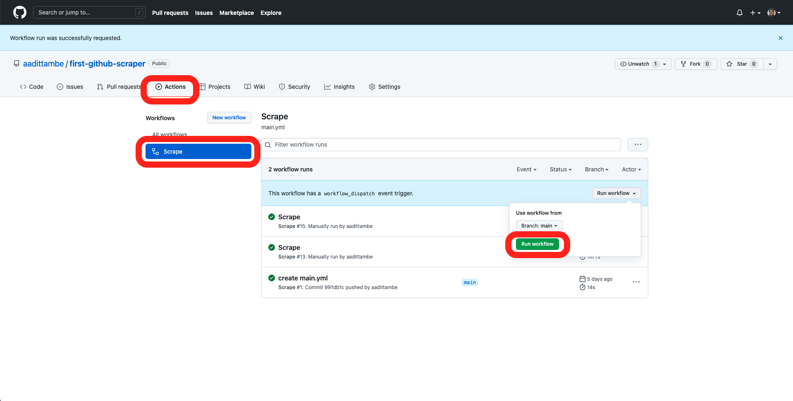

```{include} _templates/nav.html
```

# Saving the data

This chapter will walk you through how to save the data in the repository, and spot and fix common errors.  

```{contents} Sections
  :depth: 1
  :local:
```

## Log the result

On your computer, navigate to the `main.yml` file in the `.github/workflows` directory. Open it in your code editor. 

We will add commands to this file to ask GitHub to save the results of the scraper. 

We will accomplish this by instructing the Action to `add`, `commit` and `push` changes after the scraper runs, so they will show up in our respository. This is very similar to the commands you would write to push local changes to GitHub the command line.

```{code-block} yaml
:emphasize-lines: 22-29
name: Scrape

on:
  schedule:
    - cron: "0 8 * * *" # 8 a.m. every day UTC
  workflow_dispatch:

jobs:
  scrape:
    runs-on: ubuntu-latest
    steps:
    - uses: actions/checkout@v2
    - name: Install pipenv
      run: pipx install pipenv
    - uses: actions/setup-python@v2
      with:
        python-version: '3.9'
        cache: 'pipenv'
    - run: pipenv install --python `which python`
    - name: Run scraper
      run: pipenv run jupyter execute scrape.ipynb
    - name: Add and commit	
      run: |-	
        git add .	
        git config user.name "Automated"	
        git config user.email "actions@users.noreply.github.com"	
        git commit -m "Latest data" 	
    - name: Push	
      run: git push
```

## Commit your changes

Save the YAML file and commit your changes to the GitHub repository.

```bash
git add .
git commit -m "added steps to save results"
git push origin main
```

## Run the Action

Navigate back to your respository on GitHub, and once again, click on the "Actions" tab. Then click on "Scrape" under "All workflows" and run the workflow. 



After the Action has run, go to the "Code" tab on GitHub, and notice a new `warn-data.csv` file logged to our repository.


```{note}
When the Action runs, it saves the data files to GitHub. The next time you want to make modifications to your code in the repository, you need to first pull the most recent changes from the remote branch on GitHub to your computer, before committing and pushing anymore changes. 

Use the `git fetch` and `git pull` commands from the command line.
```

## Examine failed actions

Let's go back to our action tab and run the action one more time.
A failed action looks like this:


Github will email you when your action fails. It can happen quite often!


To find out what went wrong with your action, click into your job. 


This action failed because there was nothing to commit when your scrape notebook `scrape.ipynb` ran for the second time. 
If the site you want to scrape updates sporadically, having nothing new to commit from every scrape won't be an issue. Let's find a way to allow github actions to succeed even if there is nothing to commit. 

## Add an action from Github Marketplace

We can easily change few lines on our code to make sure action succeeds regardless of an actual commit. However, common actions used in workflows can be found in github actions [marketplace](https://github.com/marketplace?type=actions). These actions ca  have more options that will be useful for us later on.

Let's use [this](https://github.com/marketplace/actions/add-commit) github actions to add and commit our work. 

The [examples](https://github.com/marketplace/actions/add-commit#examples) section will show you how to add this action to your existing workflow. 

Go to your actions file and replace the `Add and commit` section with the following. We are giving a new `id` attribute to the step.

```yaml
    - name: Add and commit
      id: add_commit
      uses: EndBug/add-and-commit@v8
      with:
        committer_name: Automated
        committer_email: actions@users.noreply.github.com
        message: "Latest data"
```

## Check your work

Run the action one more time and see if it fails. 


Now pull the repo back down to your local machine, and change a line in your `warn.csv`. 

Push up and run the action one more time. Check to make sure changes have been committed to your repo.


It's possible that you may want your action to fail if there was nothing to commit. But there may be a better way - like designing a custom message to be sent out to a slack channel. 

