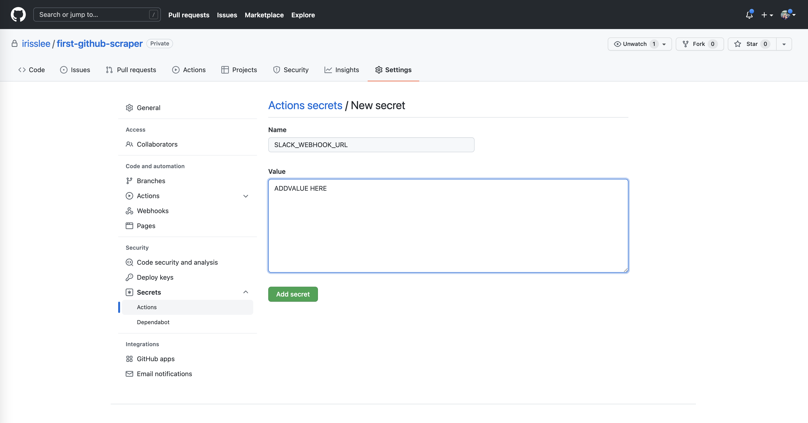

```{include} _templates/nav.html
```

# Blast the results

This chapter will walk you through creating a custom slack message for your action. 

```{contents} Sections
  :depth: 1
  :local:
```

## Join the channel and send a message

Join `#first-github-scraper` at nicar2022.slack.com

Slack's [Incoming Webhooks](https://api.slack.com/messaging/webhooks) allow you to send messages from your apps. Read [this](https://slack.com/help/articles/115005265063-Incoming-webhooks-for-Slack) for instructions on how to create one for your slack channel.  

The webhook for the first github scraper channel has been created and saved as an environment variable on your computer. Let's make sure we have them. 

```bash
echo $SLACK_WEBHOOK
```

Let's try to send a simple message using the channel's webhook.

```bash
curl -d '{"text":"Hello world. I am Iris :wave:"}'  $SLACK_WEBBHOOK
```

## Creating custom slack messages

We will be using [this](https://github.com/marketplace/actions/slack-incoming-webhook) pre-packaged action command to add slack messaging to our workflow. 

Add the below code to create a slack message you would like to see when your scrape succeeds. 

The line `${{ secrets.SLACK_WEBHOOK_URL }}` should be the value of your `$SLACK_WEBHOOK`. If your repository is public, you may want to conceal the value of your webhook. One way to do this is using [Github secrets](https://docs.github.com/en/actions/security-guides/encrypted-secrets). 

### Github secrets

To add the webhook to your github secrets, go to your repo and click on `Settings`. On the left corner you will see `Secrets` dropdown menu. Select `Actions`. Then select `New repository secrets` button on the top right corner.


Copy the value of `$SLACK_WEBHOOK` from your terminal and add to secrets. Name it `SLACK_WEBHOOK_URL`



### Customizing slack messages

Now that we added the slack webhook to secrets. Let's start adding code to our actions file. 

Copyt the code below. This first step sets the commit message as a variable to be re-used. 

```
        - name: Slack Notification on SUCCESS
        if: success()
        uses: tokorom/action-slack-incoming-webhook@main
        env:
            INCOMING_WEBHOOK_URL: ${{ secrets.SLACK_WEBHOOK_URL }}
        with:
            text: A successful scrape!
            attachments: |
            [
                {
                "color": "good",
                "author_name": "${{ github.actor }}",
                "author_icon": "${{ github.event.sender.avatar_url }}",
                "fields": [
                    {
                    "title": "GitHub Actions URL",
                    "value": "https://github.com/${{github.repository}}/actions/runs/${{github.run_id}}"
                    },
                    {
                    "title": "Commit URL",
                    "value": "https://github.com/${{github.repository}}/commits"
                    }
                ]
                }
            ]
      
```

Just below, add another step for a message created when your scrape fails. 

```
        - name: Slack Notification on FAILURE
        if: failure()
        uses: tokorom/action-slack-incoming-webhook@main
        env:
            INCOMING_WEBHOOK_URL: ${{ secrets.SLACK_WEBHOOK_URL }}
        with:
            text: Something went wrong.
            attachments: |
            [
                {
                "color": "bad",
                "author_name": "${{ github.actor }}",
                "author_icon": "${{ github.event.sender.avatar_url }}",
                "fields": [
                    {
                    "title": "GitHub Actions URL",
                    "value": "https://github.com/${{github.repository}}/actions/runs/${{github.run_id}}"
                    }
                ]
                }
            ]
      
```

Edit your action file to trigger a fail. For example, a simple change in `pipenv run jupyter execute scrape.ipynb` to `pipenv run jupyter execute s.ipynb` is going to trigger a fail. Let's see what happens to your slack message. 


## Using outputs from actions

In the previous chapter, we added a commit action that would force this workflow to succeed even when there was nothing to commit. This means we have two different definitions of "success". 

To distinguish the two different outcomes, we will use the output from the `Add and commit` step to create two different slack messages.

Some actions can create an [output](https://github.com/marketplace/actions/add-commit#outputs) that can be referenced after. 

Outputs are formatted like so `steps.<action id>.outputs.<output name>`. We will be using the `committed` output. 

For your first slack message where new files are committed, change the condition from `sucess()` to 

```
if: (success() & steps.add_commit.outputs.committed=='true')
```

Now let's add one last slack message for a successful run without a new file commit. 


```
    - name: Slack Notification on no new commits
      if: s(success() & steps.add_commit.outputs.committed=='false')
      uses: tokorom/action-slack-incoming-webhook@main
      env:
        INCOMING_WEBHOOK_URL: ${{ secrets.SLACK_WEBHOOK_URL }}
      with:
        text: Nothing was committed
```

Now run the action one more time. Because no commits have be made, your slack message will now say "Nothing was committed."


