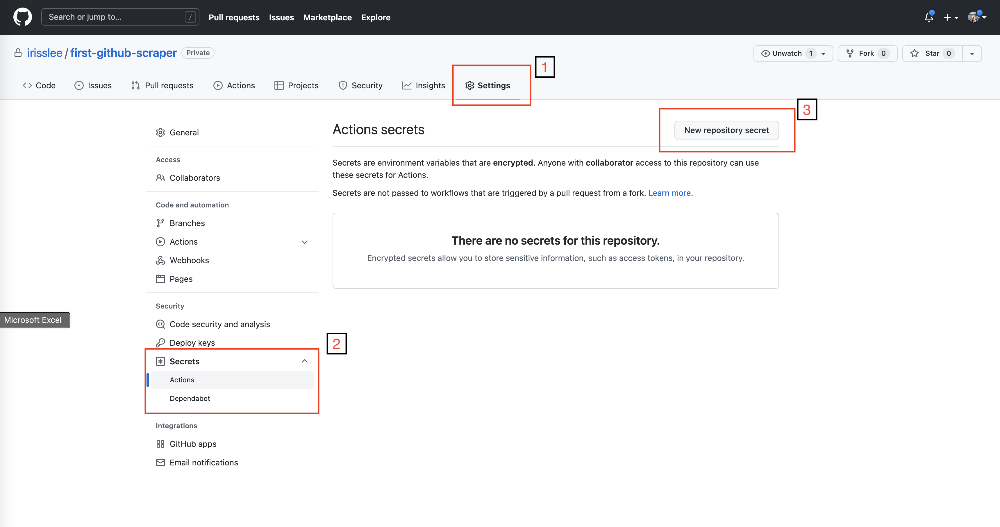
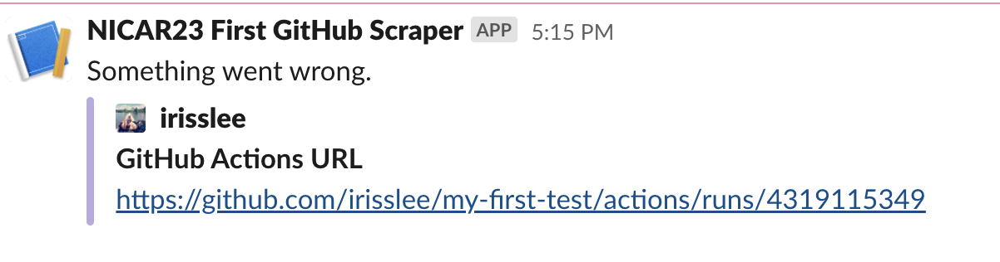

# Blast the results

This chapter will walk you through creating custom slack messages depending on the outcome of your action. 

```{contents} Sections
  :depth: 1
  :local:
```

## What kind of alerts do you need?
Now that your scrape has been automated, let's talk about alerts. You may want to receive alerts for following scenarios 
1. Your action succeeded, but nothing new was committed
2. Your action succeeded, and there's new data 
3. Your action failed 😔

## Send a message with Slack's Incoming Webhooks
Join `#nicar23` at nicar-2023-sandbox.slack.com. You should have received an email invite to slack, along with a Google Doc containing a webhook. 

Slack's incoming webhooks allow you to send messages from your apps. Visit [slack](https://api.slack.com/messaging/webhooks) for instructions on how to create one for your channel.  

Let's send a simple message using the channel's webhook.

```bash
curl -d '{"text":"Hello world. I am Iris :wave:"}'  WEBHOOK
```

## Save the Webook as a GitHub Secret

If your repository is public, you probably want to hide your webhook from others. You can do this by using [GitHub Secrets](https://docs.github.com/en/actions/security-guides/encrypted-secrets). 

To add the webhook to your GitHub secrets, go to your repo and click on `Settings`. On the left corner you will see `Secrets` dropdown menu. Select `Actions`. Then select `New repository secrets` button on the top right corner.



Copy the webhook and add as a secret. Name it `SLACK_WEBHOOK`

### Customizing your slack messages

We will be using [Slack Incoming Webhook](https://github.com/marketplace/actions/slack-incoming-webhook) action from the GitHub Actions Marketplace.

Copy the code below. This step will send a message once your action is completed 

```yaml
      - name: Slack Notification on SUCCESS
        if: success()
        uses: tokorom/action-slack-incoming-webhook@main
        env:
            INCOMING_WEBHOOK_URL: ${{ secrets.SLACK_WEBHOOK }}
        with:
            text: A successful scrape!
```

Below that add another step for a message to be sent when your scrape fails - this time let's add some useful links and colors.

```yaml
      - name: Slack Notification on FAILURE
        if: failure()
        uses: tokorom/action-slack-incoming-webhook@main
        env:
            INCOMING_WEBHOOK_URL: ${{ secrets.SLACK_WEBHOOK }}
        with:
            text: Something went wrong.
            attachments: |
            [
                {
                "color": "bad",
                "author_name": "${{ github.actor }}",
                "author_icon": "${{ github.event.sender.avatar_url }}",
                "fields": [
                    {
                    "title": "GitHub Actions URL",
                    "value": "https://github.com/${{github.repository}}/actions/runs/${{github.run_id}}"
                    }
                ]
                }
            ] 
```

Let's test it out! Edit your action file to trigger a fail. For example, a simple change in `jupyter execute scrape.ipynb` to `jupyter execute s.ipynb` is going to trigger a fail. Let's see what happens to your Slack message. 



## Use outputs to distinguish "Success"

The "Success" message will be sent whether or not a new file was committed. To differentiate between the two outcomes, we will use the output from the `Add and commit` step to create two different slack messages.

In actions, some steps can create an [output](https://github.com/marketplace/actions/add-commit#outputs) that can be referenced in another step. 

Outputs are formatted like so `steps.<action id>.outputs.<output name>`. We will be using the `committed` output, which is listed on the action's [documentation](https://github.com/marketplace/actions/add-commit#outputs). 

Let's go back to your first slack message and specify the message for a successful scrape without changes. Change the condition from `sucess()` to 

```yaml
if: (success() && steps.add_commit.outputs.committed=='false')
```
And change the message to 

```yaml
text: Nothing was committed.
```

Now let's add one last slack message for a successful run with a brand new file commit. 

```yaml
    - name: Slack Notification on no new commits
      if: (success() && steps.add_commit.outputs.committed=='true')
      uses: tokorom/action-slack-incoming-webhook@main
      env:
        INCOMING_WEBHOOK_URL: ${{ secrets.SLACK_WEBHOOK }}
      with:
        text: New file alert!
        attachments: |
        [
            {
            "color": "good",
            "author_name": "${{ github.actor }}",
            "author_icon": "${{ github.event.sender.avatar_url }}",
            "fields": [
                {
                "title": "GitHub Actions URL",
                "value": "https://github.com/${{github.repository}}/actions/runs/${{github.run_id}}"
                },
                {
                "title": "Commit URL",
                "value": "https://github.com/${{github.repository}}/commits"
                }
            ]
            }
        ] 
```

Delete the warn-data.csv file and run the action one more time. Because there has been a new file committed, your message will say "New file alert!"

Congratulations! You’ve completed the class!
