```{include} _templates/nav.html
```

# Create a repository

This chapter will walk you through how to make a repository hosted by GitHub that holds code you can edit on your local computer.

```{contents} Sections
  :depth: 1
  :local:
```

## Get started on GitHub

The first step is to visit [github.com](https://www.github.com).


If you have an account, you should [log in](https://github.com/login). If you don’t have an account, you'll need to [make one](https://github.com/signup). Once that's done GitHub will take you to [your personal homepage](https://github.com/).

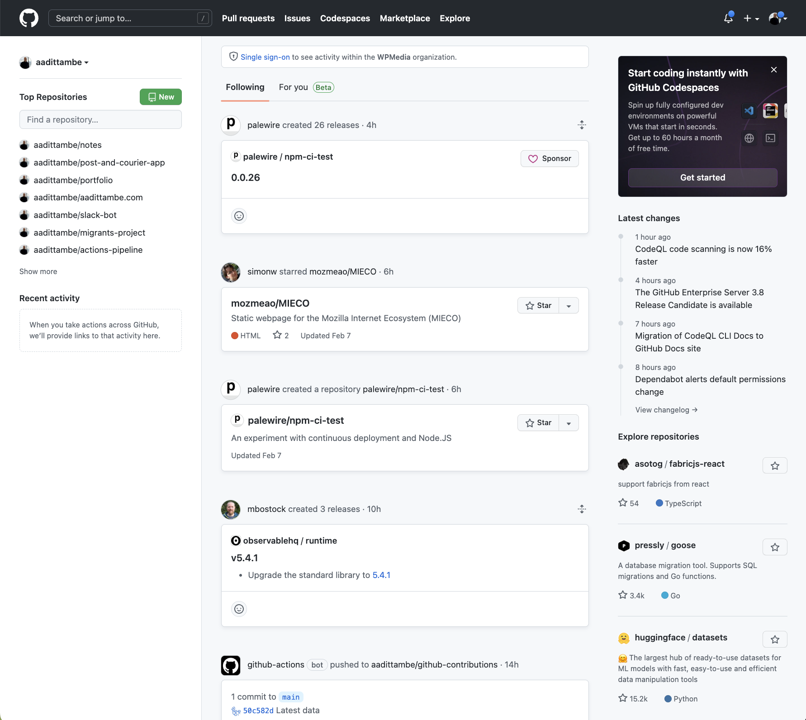

Click the green button in upper-left corner to create a [new code repository](https://github.com/new).

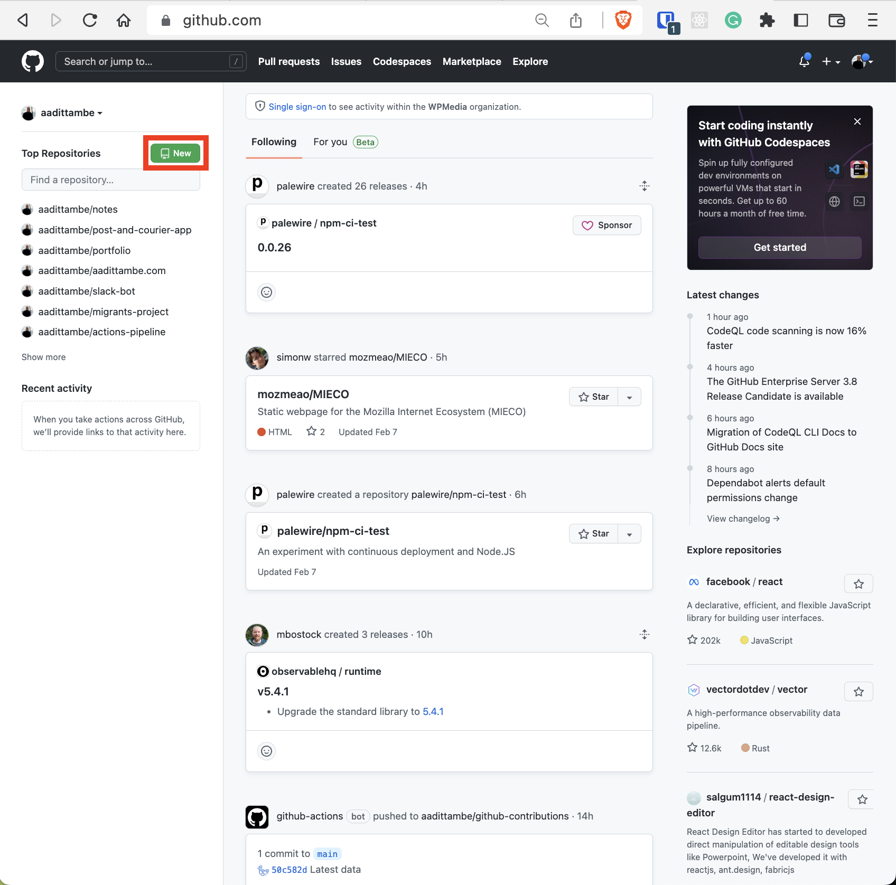

On the next page, fill in a name for your repository. Something like `my-first-github-scraper` will work, but you can name it anything.

Make sure the repo is public, which ensures your scraper will run for free. Then hit the green button at the bottom of the page.

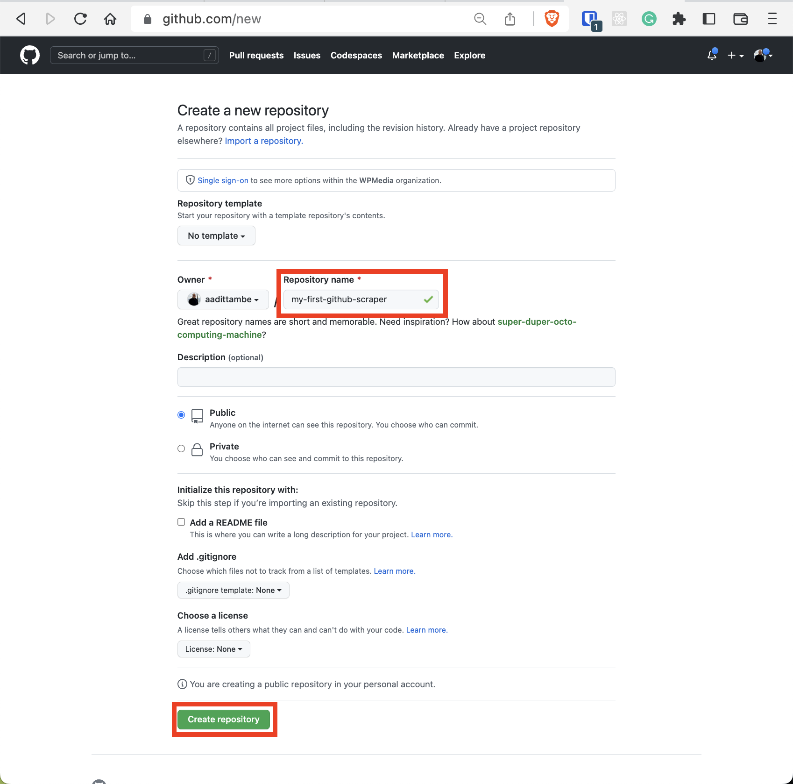

## Enter GitHub Desktop

There are several ways of interacting with the repository you created online in the previous step from your local machine.

We'll use a tool called [GitHub Desktop](https://desktop.github.com/), a GUI developed by GitHub to make communicate with the repository you created, today.

```{note}
Advanced users take advantage of their computer's command line to have more control over managing their code on [github.com](https://github.com/). We cover this advanced method of cloning the repository in step 1.4. It requires using your computer’s command-line interface.
```

Head over to the GitHub Desktop website at [desktop.github.com](https://desktop.github.com/).

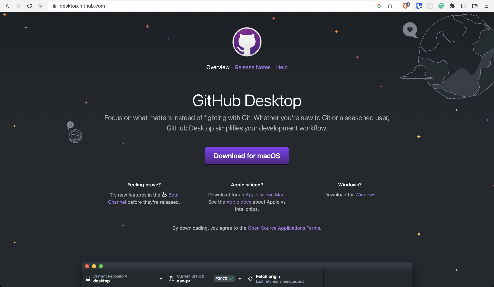

Next, depending on the type of computer you're using — a Mac or a PC — download the software. 

Depending on the directory you downloaded GitHub Desktop to, you should see a newly downloaded zipped folder. Opening it will reveal the GitHub Desktop application.

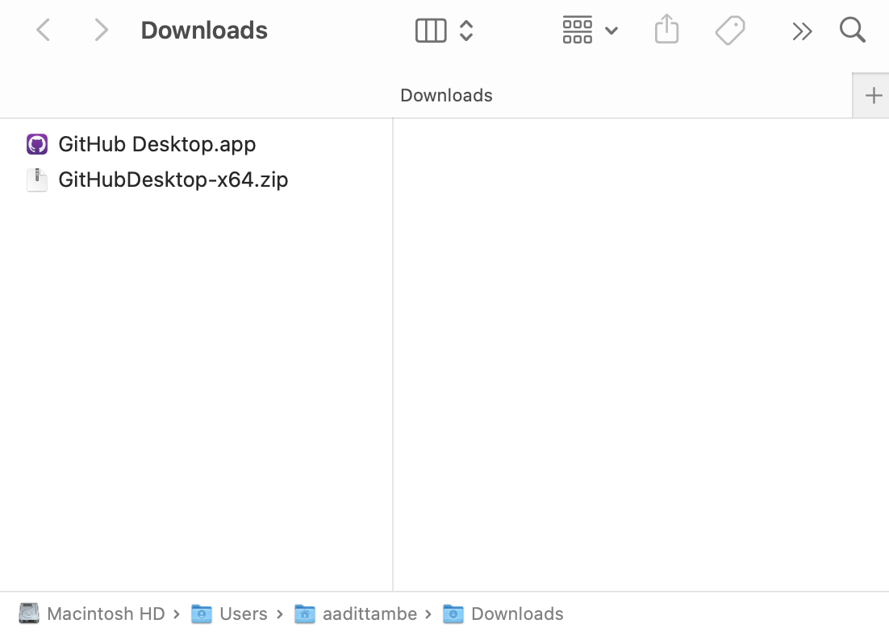

Let's open the application, and sign in. Open the settings window of the application.

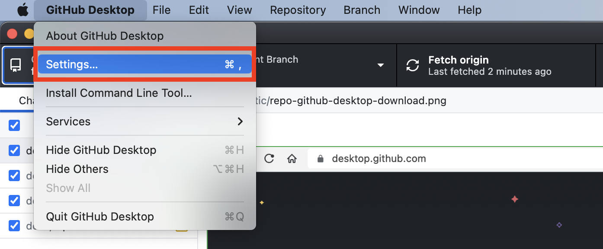

In the "Preferences" window, click "Sign In."

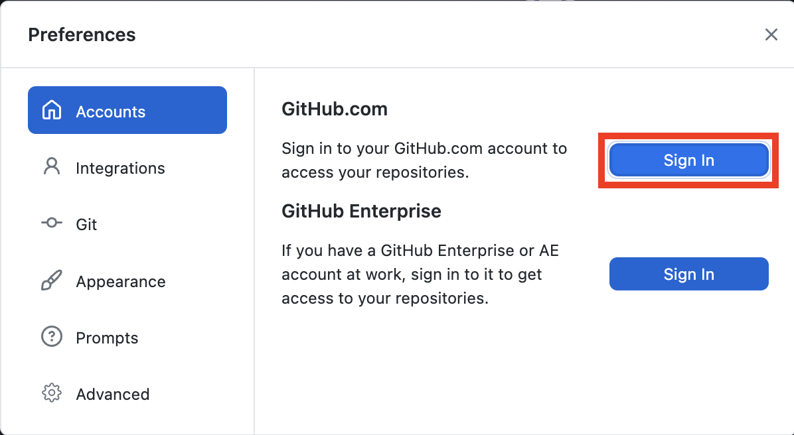

A window will show up prompting us to sign in to the account we created in [1.1] through the browser.

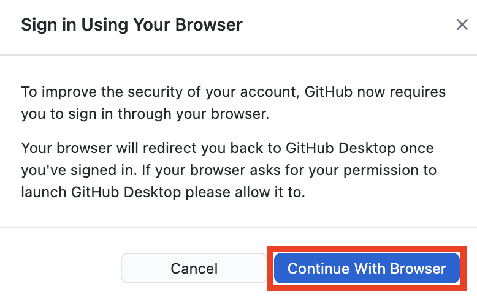

Assuming you're already signed in to GitHub in your browser, this instance should will automatically authenticate your account and direct you back to the GitHub Desktop application.

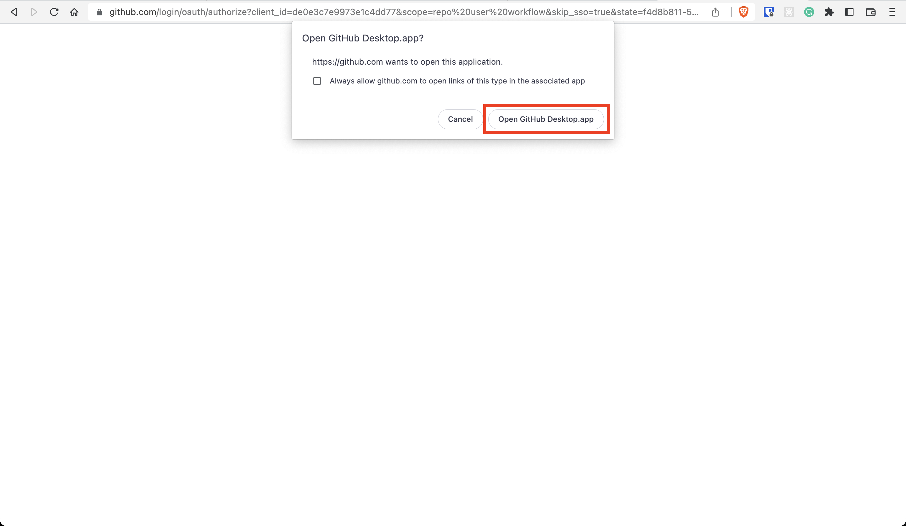

Now, let's use GitHub Desktop to download the repo we created in [1.1] on your local computer in the next step.

## Clone the repository

There are numerous methods for downloading the code in an online repository, which GitHub calls "cloning." They are covered in [GitHub’s documentation](https://docs.github.com/en/repositories/creating-and-managing-repositories/cloning-a-repository).

This tutorial will demonstrate how to use GitHub Desktop (which we installed in step [1.2]) to download clone the repository (which we created in step [1.1]).

In the GitHub Desktop app, click on the "Add" button, and then on the "Clone Repository" option.

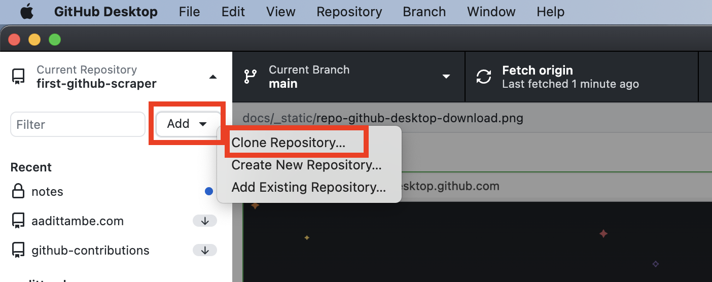

A window will show up asking us which repository associated with our GitHub account we would like to clone on our computer.

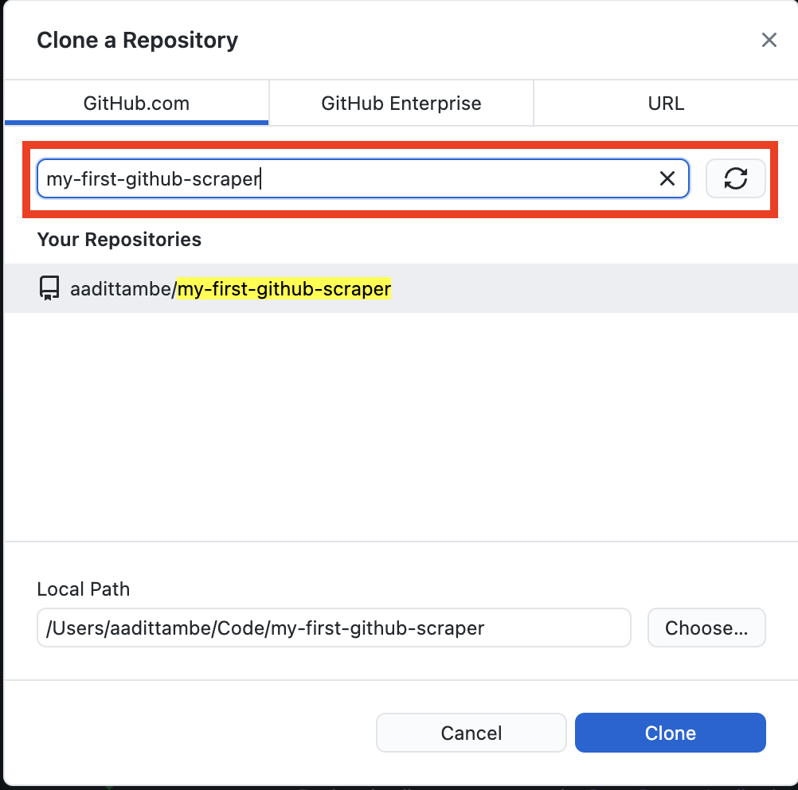

As you start typing the name of the repository — "my-first-github-scraper" — you will see it listed in the dropdown options.

In this window, you will see an option for specifying a "Local Path." This is the directory on your computer in which the repository will be cloned. In my case, it is in a directory called `Code.`

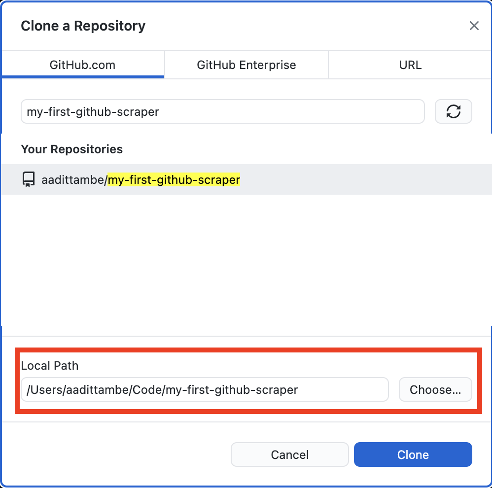

Click on the blue "Clone" button.

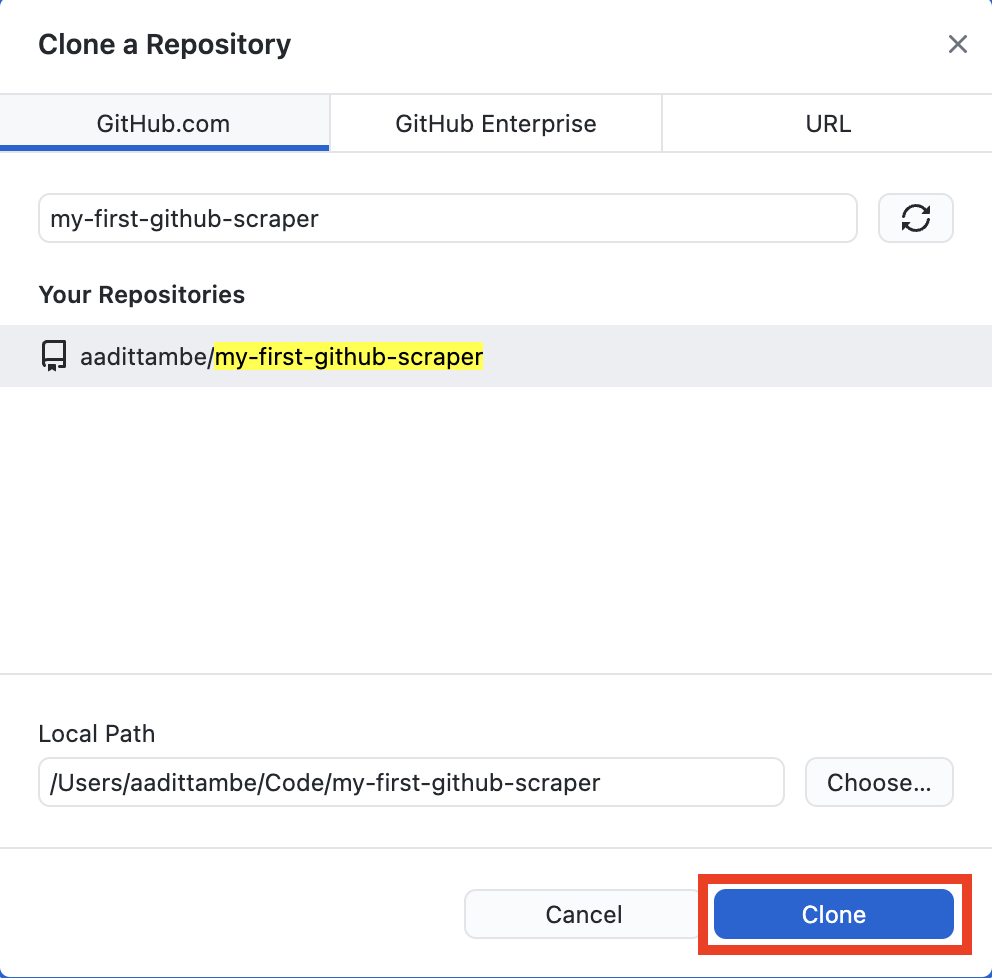

GitHub Desktop will clone the repository, and you will be taken to a screen that looks like this. Note, in the top left corner is the name of the repository we are currently in. 

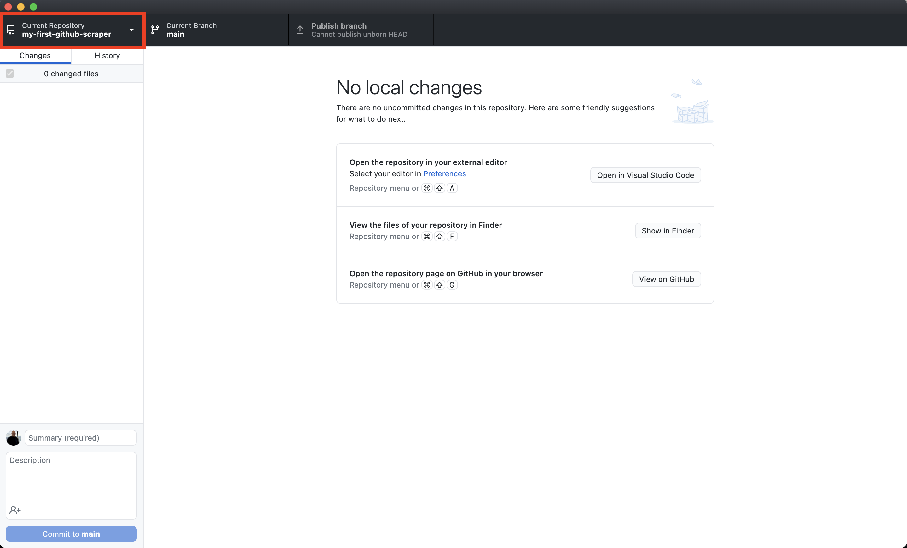

Next we’ll install a Python web scraper and start downloading data.


## Advanced Git (Optional)

While there are numerous ways to interact with your repository on GitHub, advanced users generally use the command line for managing their files — also known pulling and pushing code — between their local machines and the remote repository on GitHub for more control.

This **optional** section will demonstrate how to use the [`gh`](https://cli.github.com/) command-line utility to accomplish what we did in step [1.3]. If you don't have it installed, visit [cli.github.com](https://cli.github.com/) and follow the instructions there.


### Introduction to the command line
Whether you know it or not, there is a way to open a special window and directly issue commands to your operating system. Different systems give this tool slightly different names, but they all have some form of it.

On Windows this is called the “command prompt.” On MacOS it is called the “terminal.” Others may call it the “command line.” They’re the same thing, just in different slightly shapes.

This is the tool we’ll use to make a copy of your repository on your computer. Depending on your operating system and personal preferences, open a terminal program so we can get started.

```{note}
If you're a Windows user, we recommend you avoid the standard command line provided by the operating system. Instead, you'd be well served by the [Windows Subsystem for Linux](https://docs.microsoft.com/en-us/windows/wsl/install-win10), which will create a development environment better suited for open-source software work.

We recommend you install the Ubuntu distribution from the Windows Store. This will give you access to a generic terminal without the quirks of Windows.
```

Once you have your terminal open, it will start you off in your computer’s home directory, much like your file explorer.

Let’s verify that using a command called [`pwd`](https://en.wikipedia.org/wiki/Pwd), which stands for present working directory. The output is the full path of your terminal’s current location in the file system. You should get back something like `/Users/aadittambe`.

```bash
pwd
```

Next let’s enter the [`ls`](https://en.wikipedia.org/wiki/Ls) command to see all of its subdirectories. The terminal should print out the same list of folders you can see in your home directory via the file explorer.

```bash
ls
```

### Create a code directory

Using GitHub Desktop took care of this step for us. However, if we were to use `gh` to clone the repository, we would need to first create a directory on the computer to store our code.

We will use the [`mkdir`](https://en.wikipedia.org/wiki/Mkdir) command to create a new directory in the same style as the Desktop, Documents and Downloads folders included by most operating systems.

We will name this folder `Code`. To verify the command works, open the file explorer and navigate to your home folder. After it’s run, you should see the new directory alongside the rest.

```bash
mkdir Code
```

Now jump into the new directory with the [`cd`](https://en.wikipedia.org/wiki/Cd_(command)) command, which operates the same as double clicking on a folder in your file explorer.

```bash
cd Code
```

This is the location where we’ll download a copy of your repository.


### Clone the repository

In order to clone the repository, you need to make sure you have `gh` installed by executing the following command, which should print out the version of gh you have installed.


```bash
gh --version
```

The output should look something like this:

```bash
gh version 2.5.1 (2022-02-15)
https://github.com/cli/cli/releases/tag/v2.5.2
```

```{note}
If you get an error instead, open a fresh terminal and try again. If it’s still not working, revisit [cli.github.com](https://cli.github.com) to make sure you've followed all the necessary steps.
```

Use `gh` to login to GitHub, which will verify that your computer has permission to access and edit the repositories owned by your account.

```bash
gh auth login
```

After you authenticate, it’s time to clone the new repository we created. Edit the code below by inserting your user name and repository. Then run it.

```bash
gh repo clone https://github.com/<your-username>/<your-repo>
```

In my case, the command looks like this:

```bash
gh repo clone https://github.com/aadittambe/my-first-github-scraper
```

After clone completes, run the `ls` command again. You should see a new folder created by `gh`.

```bash
ls
```

Use `cd` to move into the directory, where we can begin work.

```bash
cd my-first-github-scraper
```

