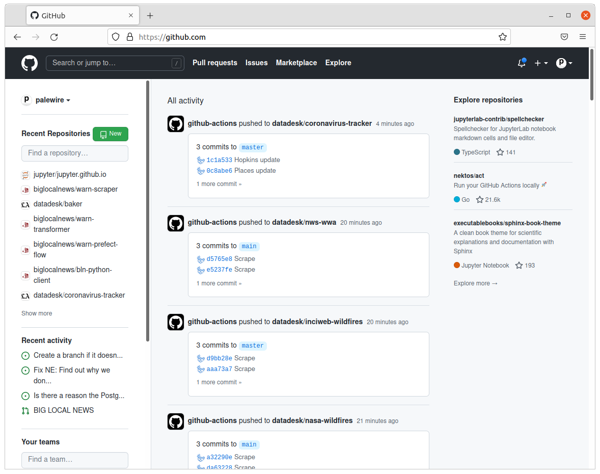
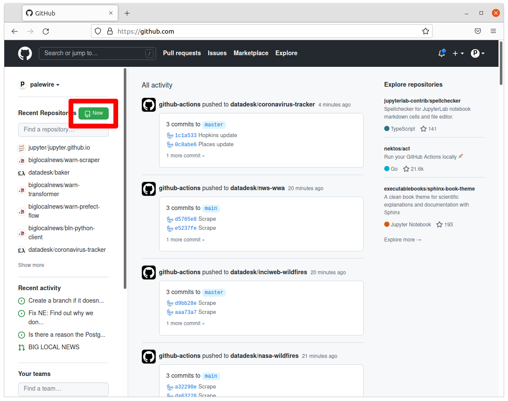
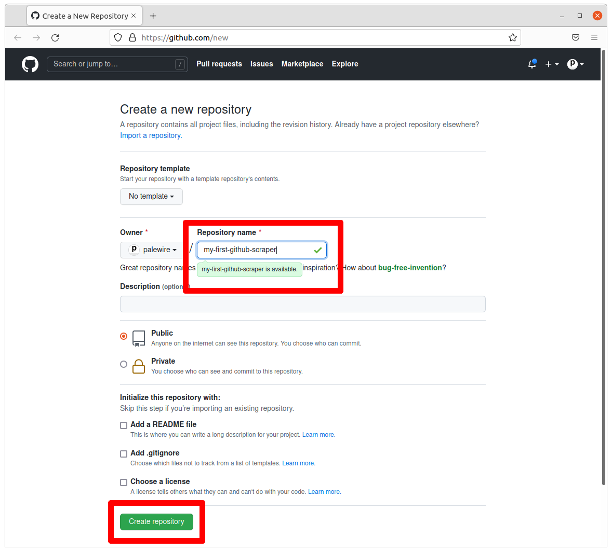
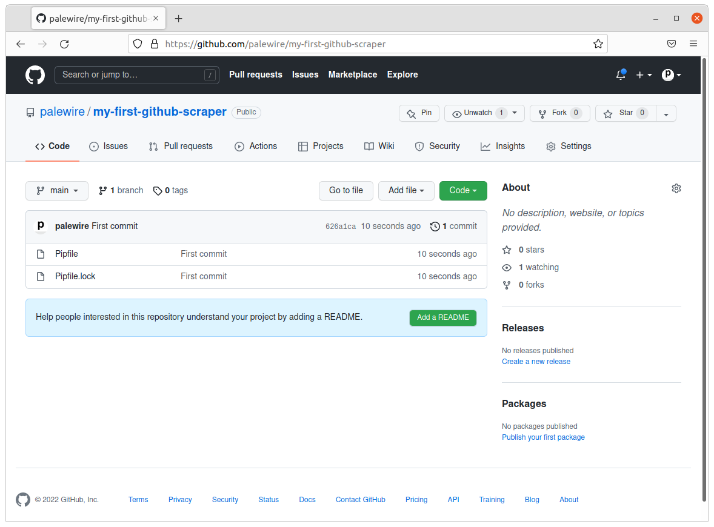

```{include} _templates/nav.html
```

# Create a repository

This chapter will walk you through how to make a repository hosted by GitHub that holds code you can edit on your local computer.

```{contents} Sections
  :depth: 1
  :local:
```

## Get started on GitHub

The first step is to visit [github.com](https://www.github.com).


If you have an account, you should [log in](https://github.com/login). If you don’t have an account, you'll need to [make one](https://github.com/signup). Once that's done GitHub will take you to [your personal homepage](https://github.com/).



Click the green button in upper-left corner to create a [new code repository](https://github.com/new).



On the next page, fill in a name for your repository. Something like `my-first-github-scraper` will work, but you can name it anything.

Make sure the repo is public, which ensures your scraper will run for free. Then hit the green button at the bottom of the page.



## Clone the repository

Whether you know about it or not, there should be a way to open a window and directly issue commands to your operating system. Different operating systems give this tool slightly different names, but they all have some form of it.

On Windows this is called the “command prompt.” On MacOS it is called the “terminal.” Other people will call it the “command line.”

This is the tool we’ll use to make a copy of your repository on your computer. Depending on your operating system and personal preferences, open up a terminal program.

```{note}
If you're a Windows user, we recommend you avoid the standard command line provided by the operating system. Instead, you'd be well served by the [Windows Subsystem for Linux](https://docs.microsoft.com/en-us/windows/wsl/install-win10), which will create a development environment better suited for open-source software work. We recommend you install the Ubuntu distribution from the Windows Store. This will give you access to a generic terminal without all the complications and quirks of Windows.
```

Once you have your terminal open, it will start you off in your computer’s home directory, much like your file explorer. Let’s verify where we are using a command called [`pwd`](https://en.wikipedia.org/wiki/Pwd), which stands for present working directory. The output is the full path of your location in the file system, something like `/Users/palewire/`, your home directory.

```bash
pwd
```

Next let’s enter the [`ls`](https://en.wikipedia.org/wiki/Ls) command and press enter to see all of the folders there now. It should print out the same list of folders you can see in your home directory via the file explorer.

```bash
ls
```

Our first task is to create a folder to store our code. Use the [`mkdir`](https://en.wikipedia.org/wiki/Mkdir) command to create a new directory in the same style as the Desktop, Documents and Downloads folders included by most operating systems. We will name this folder `Code`. To verify it worked, open the file explorer and navigate to your home folder.

```bash
mkdir Code
```

Now jump into the Code directory, which is the same as double clicking on a folder in your file explorer.

```bash
cd Code
```

This is the location where we'll download a copy of your repository.

There are numerous methods for cloning code, covered in [GitHub’s documentation](https://docs.github.com/en/repositories/creating-and-managing-repositories/cloning-a-repository). This tutorial will demonstration how to use the [`gh`](https://cli.github.com/) command-line utility. If you don't have it installed, visit [cli.github.com](https://cli.github.com/) and follow the instructions there.

You can verify you’re ready by executing the following command, which should print out the version of `gh` you have installed.

```bash
gh --version
```

The output should look something like this:

```bash
gh version 2.5.1 (2022-02-15)
https://github.com/cli/cli/releases/tag/v2.5.1
```

```{note}
If you get an error instead, open a fresh terminal and try again. If it’s still not working, revisit [cli.github.com](https://cli.github.com) to make sure you've followed all the necessary steps.
```

Use `gh` to login to GitHub, which will verify that your computer has permission to access and edit the repositories owned by your account.

```bash
gh auth login
```

After you authenticate, it’s time to clone the new repository we created. Edit the code below by inserting your user name and repository. Then run it.

```bash
gh clone <your-username>/<your-repo>
```

In my case, the command looks like this:

```bash
gh repo clone palewire/my-first-github-scraper
```

After clone completes, run the `ls` command again. You should see a new folder created by `gh`.

```bash
ls
```

Use `cd` to move into the directory, where we can begin work.

```bash
cd my-first-github-scraper
```

## Install pipenv

Our web scraper will depend on a set of Python tools that we’ll need to install before we can run the code. They are the [JupyterLab](https://jupyter.org/) computational notebook, the [requests](https://docs.python-requests.org/en/latest/) library for downloading webpages and [BeautifulSoup](https://beautiful-soup-4.readthedocs.io/en/latest/), a handy utility for parsing data out of HTML. 

By default, Python's third-party packages are all installed in a shared folder somewhere in the depths of your computer. Unless they are told otherwise, every Python project on your computer will draw from this common pool of programs.

This approach is fine for your first experiments with Python, but it quickly falls apart when you start to get serious about coding.

For instance, say you develop a web application today with [Flask](https://palletsprojects.com/p/flask/) version 1.1. What if, a year from now, you want to start a new project and use a newer version of Flask? Your old app is still running and may requires occasional patches, but you may not have time to re-write all of your old code to make it compatible with the latest version.

Open-source projects are changing every day and such conflicts are common, especially when you factor in the sub-dependencies of your project’s direct dependencies, as well as the sub-dependencies of those sub-dependencies.

Programmers solve this problem by creating a [virtual environment](https://docs.python.org/3/tutorial/venv.html) for each project, which isolates the code into discrete, independent containers that do not rely on the global environment.

Strictly speaking, working within a virtual environment is not required. At first, it might even feel like a hassle. But in the long run, you will be glad you did it. And you don’t have to take our word for it, you can read discussions on [StackOverflow](https://conda.io/docs/index.html) and [Reddit](https://www.reddit.com/r/Python/comments/2qq1d9/should_i_always_use_virtualenv/).

There are several different ways to run a virtual environment. In this tutorial, we will take advantage of [pipenv](https://pipenv.kennethreitz.org/en/latest/), a widely used tool that is recommended by leaders in the Python community.

Like the commands we've already learned, pipenv is executed with your computer's command-line interface. You can verify it’s there by typing the following into your terminal:

```bash
pipenv --version
```

If you have it installed, you should see the terminal respond with the version on your machine.

```bash
pipenv, version 2021.11.23
```

If you get an error that says pipenv isn’t present, you will need to install it.

If you are on a Mac, pipenv’s maintainers [recommend](https://pipenv.kennethreitz.org/en/latest/install/#homebrew-installation-of-pipenv) installing via the [Homebrew](https://brew.sh/) package manager, like so:

```bash
brew install pipenv
```

If you are on Windows and using the [Windows Subsystem for Linux](https://docs.microsoft.com/en-us/windows/wsl/install-win10), you can install Homebrew's cousin [Linuxbrew](https://docs.brew.sh/Homebrew-on-Linux) and use it to install Pipenv.

If neither option makes sense for you, Pipenv's [docs](https://pipenv.kennethreitz.org/en/latest/install/#pragmatic-installation-of-pipenv) recommend a [user install](https://pip.pypa.io/en/stable/user_guide/#user-installs) via pip:

```bash
pip install --user pipenv
```

Whatever installation route you choose, you can confirm your success by testing for its version again:

```bash
pipenv --version
```

## Install Python tools

Now let's pipenv to use and install our Python packages. We can add them to our project's virtual environment by typing their names after pipenv’s `install` command. Save yourself some hassle; Copy and paste it.

```bash
pipenv install jupyterlab requests bs4
```

When you invoke Pipenv's `install` command, it checks for an existing virtual environment connected to your project’s directory. Finding none, it creates one, then installs your packages into it.

The packages we’ve requested are downloaded and installed from the [Python Package Index](https://pypi.org/), an open directory of free tools. Each of our programs has a page there. For instance, JupyterLab is indexed at [pypi.org/project/jupyterlab](https://pypi.org/project/jupyterlab/). 

When the installation finishes, two files will added to your project directory: `Pipfile` and `Pipfile.lock`. Open them files in a text editor and you'll see how they describe your project’s Python requirements.

In the `Pipfile`, you'll see the name and exact version of any package we directed Pipenv to install. We didn't specify an exact version, so you'll see:

```
[packages]
jupyterlab = "*"
requests = "*"
bs4 = "*"
```

`Pipfile.lock` has a more complicated, nested structure that specifies the exact version of your project's direct dependencies, along with all their sub-dependencies. It’s a complete blueprint for how to install your project on any computer.

## Save to GitHub

Now we'll log our work with [`git`](https://en.wikipedia.org/wiki/Git), a command-line tool that allows us to carefully track changes files in our repository. It is the open-source technology at the heart of GitHub’s social network and publishing system.

The first command to learn is [`status`](https://git-scm.com/docs/git-status), which prints out a report card on the current state of your repository.

```bash
git status
```

Run it and your terminal should print out the `Pipfile` and `Pipfile.lock` we've added to the repository. The next step is to officially add the files to your repository for tracking with git’s [`add`](https://git-scm.com/docs/git-add) command.

```bash
git add Pipfile
git add Pipfile.lock
```

```{note}
You can add all of the files in your repository by adding a [wildcard character](https://en.wikipedia.org/wiki/Wildcard_character) to the end of your command, `git add .`
```

Log the addition of your new files with git’s [`commit`](https://git-scm.com/docs/git-commit) command. You should include a summary of your work after the `-m` flag.

```bash
git commit -m "First commit"
```

````{note}
If this is your first time using Git, you may be prompted to configure you name and email. If so, take the time now. 

```bash
git config --global user.email "your@email.com"
git config --global user.name "your name"
```

Then run the `commit` command above again.
````

The final step is to syncronize the changes we've made on our computer with the copy of the repository hosted on github.com. This is done via git’s [`push`](https://git-scm.com/docs/git-push) command. This complicated command requires two inputs.

First, the nickname of the remote repository you'd like to send your changes. In the parlance of git, the default name is `origin`.

Second, you need to provide the [branch](https://en.wikipedia.org/wiki/Branching_(version_control) of the code you'd like to syncronize. Branching is a tool for maintaining parallel version of your code within the same respository. We won't get that sophisticated in this tutorial. We'll stick to the default code branch, which is typically called `main`.

So, taking all that into account, the standard command to push local changes to GitHub is typically the following. Try it. 

```bash
git push origin main
```

Your terminal should log the action, reporting back on its interaction with GitHub. Congratulations. You have made your first code commit. Reload your repository’s on GitHub to see your handiwork.



Next we'll work on introducing a web scraper into the code management system you’ve prepared.
