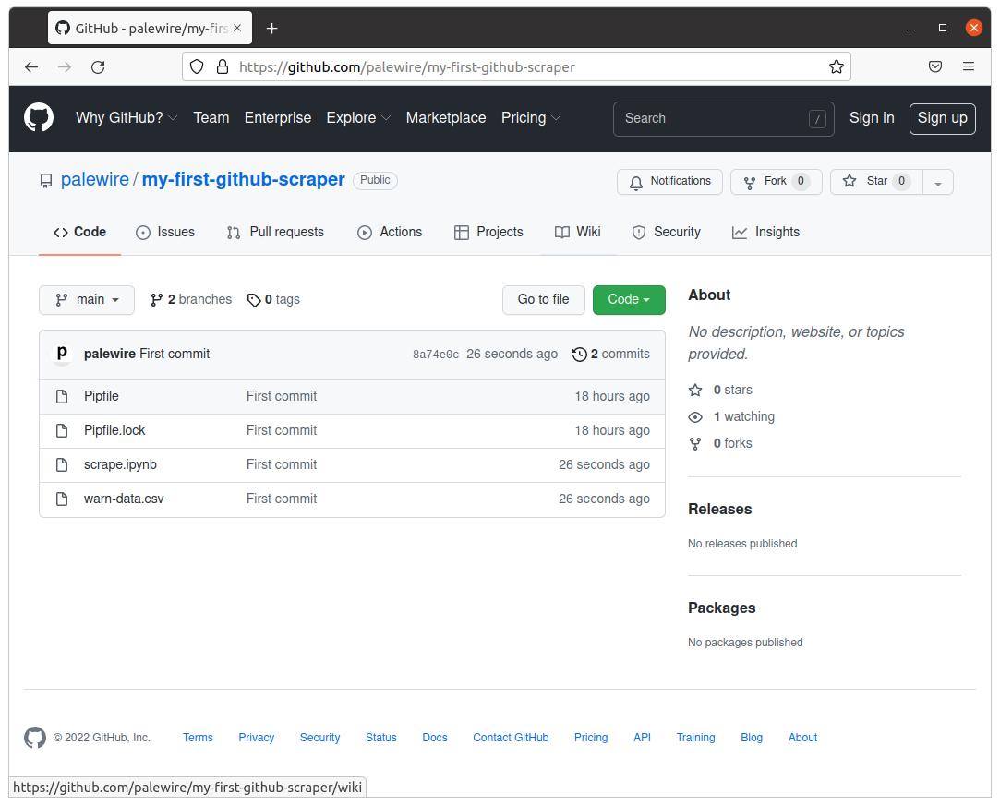

<nav>
  <div class="row">
    <div class="sevencol">
      <div class="shingle">
        <a href="https://palewi.re/">
          <div rel="rnews:copyrightedBy rnews:hasSource rnews:providedBy">
            <div about="http://palewi.re/" typeof="rnews:Organization">
              <div property="rnews:name">palewire</div>
            </div>
          </div>
        </a>
      </div>
    </div>
    <div class="fivecol last links">
      <ul>
        <li>
          <a href="http://palewi.re/posts/" title="Posts">
            Posts
          </a>
        </li>
        <li>
          <a href="http://palewi.re/work/" title="Work">
            Work
          </a>
        </li>
        <li>
          <a href="http://palewi.re/talks/" title="Talks">
            Talks
          </a>
        </li>
        <li>
          <a href="http://palewi.re/who-is-ben-welsh/" title="Who is Ben Welsh?">
            About
          </a>
        </li>
      </ul>
    </div>
  </div>
</nav>
<div class="row topbar">
    <div class="twelvecol last"></div>
</div>

# Create a repository

This chapter will walk you through how to make a repository hosted by GitHub that holds code you can edit on your local computer.

## Get started on GitHub

The first step is to visit [github.com](https://www.github.com).


If you have an account, you should [log in](https://github.com/login). If you don’t have an account, you'll need to [make one](https://github.com/signup). Once that's done GitHub will take you to [your personal homepage](https://github.com/).


Click the green button in upper-left corner to create a [new code repository](https://github.com/new).


On the next page, fill in a name for your repository. Something like `my-first-github-scraper` will work, but you can name it anything you like.

Make sure the repo is public — which ensures your scraper will run for free — and then hit the big green button at the bottom of the page.


## Clone the repository

Whether you know about it or not, there should be a way to open a window and directly issue commands to your operating system. Different operating systems give this tool slightly different names, but they all have some form of it.

On Windows this is called the “command prompt.” On MacOS it is called the “terminal.” Other people will call this the “command line.”

On Windows, we recommend you install the [Windows Subsystem for Linux](https://docs.microsoft.com/en-us/windows/wsl/install-win10) and select the Ubuntu distribution from the Windows Store. This will give you access to a generic open-source terminal without all the complications and quirks introduced by Windows. On MacOS, the standard terminal app will work fine.

Depending on your operating system and personal preferences, open up a terminal program. It will start you off in your computer’s home directory, just like your file explorer. Enter the following command and press enter to see all of the folders there now.

```bash
ls
```

Now let’s check where we are in our computer's file system. For this we'll use a command called [pwd](https://en.wikipedia.org/wiki/Pwd), which stands for present working directory. The output is the full path of your location in the file system, something like `/Users/palewire/`.

```bash
pwd
```


Use the [mkdir](https://en.wikipedia.org/wiki/Mkdir) command to create a new directory for your code. In the same style as the Desktop, Documents and Downloads folders included by most operating system, we will name this folder Code.

```bash
mkdir Code
```

To verify that worked, you can open in your file explorer and navigate to your home folder. Now jump into the Code directory, which is the same as double clicking on a folder to enter it in your filesystem navigator.

```bash
cd Code
```

This is where we'll clone a copy of your repository, which we'll edit locally and then push back up to GitHub.

There are numerous methods for cloning code, covered in [GitHub’s documentation](https://docs.github.com/en/repositories/creating-and-managing-repositories/cloning-a-repository). This tutorial will demonstration how to use the [`gh`](https://cli.github.com/) command-line utility. If you don't have it installed, visit [cli.github.com/](https://cli.github.com/) and follow the instructions there.

You can verify you have it by executing the following command, which should print out the version you have installed.

```bash
gh --version
```

The output should look something like this:

```bash
gh version 2.5.1 (2022-02-15)
https://github.com/cli/cli/releases/tag/v2.5.1
```

```{note}
If you get an error instead, open a fresh terminal and try again. Still not there? Revisit [cli.github.com](https://cli.github.com) to make sure you've followed all the necessary steps.
```

Now you should use `gh` to login to GitHub, which will verify that you have permission to edit your repositories.

```bash
gh auth login
```

After you authenticate, it’s time to clone the repository we made. You'll want to edit the code below by inserting your user name and repository.

```bash
gh clone <your-username>/<your-repo>
```

In my case, the command looks like this:

```bash
gh repo clone palewire/my-first-github-scraper
```

After clone completes, move into that directory.

```bash
cd my-first-github-scraper
```

## Install pipenv

Our web scraper depends on a set of Python tools that we'll need to install before we can run the code. They are the [JupyterLab](https://jupyter.org/) computational notebook, the [requests](https://docs.python-requests.org/en/latest/) library for downloading webpages and [BeautifulSoup](https://beautiful-soup-4.readthedocs.io/en/latest/), a handy utility for parsing data out of HTML. 

By default, Python's third-party packages are all installed in a shared "global" folder somewhere in the depths of your computer. By default, every Python project on your computer draws from this same set of installed programs.

This approach is fine for your first experiments with Python, but it quickly falls apart when you start to get serious about coding.

For instance, say you develop a web application today with [Flask](https://palletsprojects.com/p/flask/) version 1.1. What if, a year from now, you want to start a new project and use a newer version of Flask? Your old app is still live and requires occasional patches, but you don't have time to re-write all of your old to make it compatible with the latest version of Flask.

Open-source projects are changing every day and such conflicts are common, especially when you factor in the sub-dependencies of your project’s direct dependencies, as well as the sub-dependencies of those sub-dependencies.

Programmers solve this problem by creating a [virtual environment](https://docs.python.org/3/tutorial/venv.html) for each project that isolates them into discrete, independent containers that do not rely on code in the global environment.

Strictly speaking, working within a virtual environment is not required. At first, it might even feel like a hassle. But in the long run, you will be glad you did it. And you don’t have to take my word for it, you can read discussions on [StackOverflow](https://conda.io/docs/index.html) and [Reddit](https://www.reddit.com/r/Python/comments/2qq1d9/should_i_always_use_virtualenv/).

Good thing [pipenv](https://pipenv.kennethreitz.org/en/latest/) can do this for us.

Pipenv and its prerequisites are installed via your computer's command-line interface. You can verify it’s there by typing the following into your terminal:

```bash
pipenv --version
```

If you have it installed, you should see the terminal respond with the version on your machine.

```bash
pipenv, version 2018.11.26
```

If you get an error, you will need to install it.

If you are on a Mac, Pipenv’s maintainers [recommend](https://pipenv.kennethreitz.org/en/latest/install/#homebrew-installation-of-pipenv) installing via [Homebrew](https://brew.sh/):

```bash
brew install pipenv
```

If you are on Windows and using the [Windows Subsystem for Linux](https://docs.microsoft.com/en-us/windows/wsl/install-win10), you can install [Linuxbrew](https://docs.brew.sh/Homebrew-on-Linux) and use it to install Pipenv.

If neither option makes sense for you, Pipenv's [docs](https://pipenv.kennethreitz.org/en/latest/install/#pragmatic-installation-of-pipenv) recommend a [user install](https://pip.pypa.io/en/stable/user_guide/#user-installs) via pip:

```bash
pip install --user pipenv
```

Whatever installation route you choose, you can confirm your success by testing for its version again:

```bash
pipenv --version
```

## Install Python tools

Now let's install a our Python packages to see Pipenv in action. We can add them to our project's private virtual environment by typing their names after pipenv’s install command. Save yourself some hassle; Copy and paste it.

```bash
pipenv install jupyterlab requests bs4
```

When you invoke Pipenv's `install` command, it checks for an existing virtual environment connected to your project’s directory. Finding none, it creates one, then installs your packages into it.

As a result, two files are added to your project directory: `Pipfile` and `Pipfile.lock`. Open these files in a text editor and you'll see how they describe your project’s Python requirements.

In the `Pipfile`, you'll see the name and exact version of any package we directed Pipenv to install. We didn't specify an exact version, so you'll see:

```
[packages]
jupyterlab = "*"
requests = "*"
bs4 = "*"
```

`Pipfile.lock` has a more complicated, nested structure that specifies the exact version of your project's direct dependencies along with all their sub-dependencies.

## Commit your work with GitHub

Now we'll log our work with git’s version control system, which carefully tracks the changes to every file in your repository. We can see the changes git has noticed by running the status command.

```bash
git status
```

That will list out the `Pipfile` and `Pipfile.lock` we've added to the repository. The next step is to officially add the files to your repository for tracking with git's `add` command.

```bash
git add Pipfile
git add Pipfile.lock
```

```{note}
You can add all of the files in your repository by running a wildcard command like `git add .`
```

Log its creation with Git's `commit` command. You can include a personalized message after the `-m` flag.

```bash
git commit -m "First commit"
```

If this is your first time using Git, you may be prompted to configure you name and email. If so, take the time now. Then run the `commit` command above again.

```bash
git config --global user.email "your@email.com"
git config --global user.name "your name"
```

Finally, push your commit up to GitHub.

```bash
git push origin main
```

You just created your first code commit. Reload your repository on GitHub and see your handiwork.



Next we'll work on introducing a web scraper into the code management system you've prepared.
