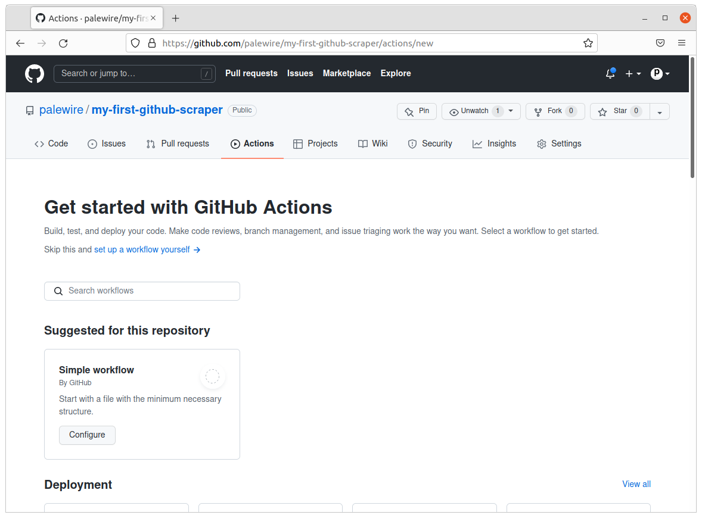
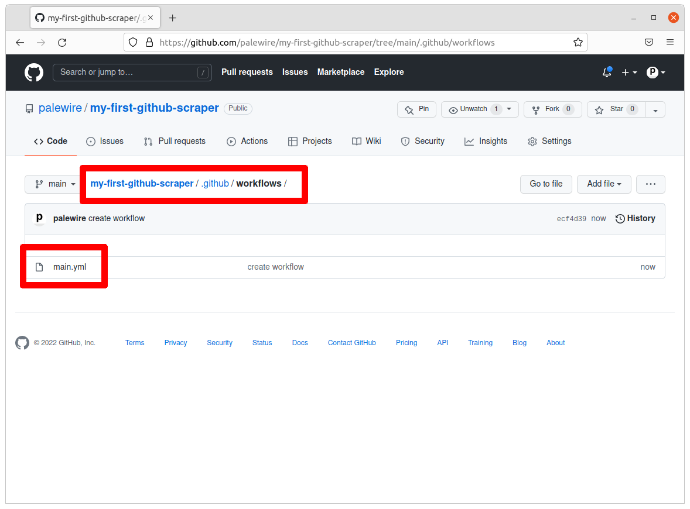
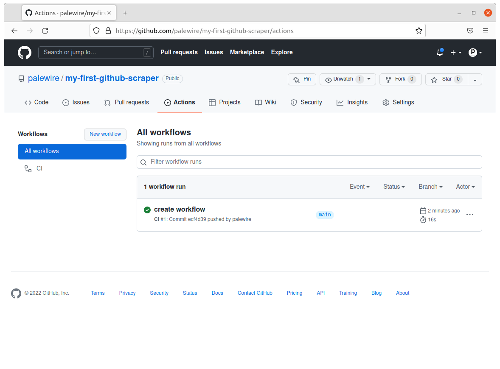

```{include} _templates/nav.html
```

# Create an Action

This chapter will walk you through how to create a GitHub Action that executes a scraper on a schedule.

```{contents} Sections
  :depth: 1
  :local:
```

## Getting started with Actions on GitHub

Navigate back to the GitHub repo and click on the "Actions" tab. This page will display a log of the Action we configure.



Click on "set up a workflow yourself," which will take you a workflow template created by GitHub, which we will use to get started. 

Without changing anything, push the green "Start commit" button. Write a commit message "create workflow" and commit this workflow to the GitHub repo. We can stick with the default name for the file, `main.yml`.


After you commit, you will be navigated back to the "Code" tab. Note that a directory `workflows` was created inside a hidden `.github` directory in the repo after the commit. All your Actions will live inside the `.github/workflows` directory.



## Understand the Action

Navigate back to the "Actions" tab and notice that it logged the first run of the template workflow you just created. 



Click on "create workflow" next to the green check and then click on "build" to explore and understand our Action.


The check mark next to each step indicates that the step was successfully executed. This workflow executed a single job called "build." 

The first two steps — "Set up job" and "Run actions/checkout@v2" — create an environment to run the Action. 

The third step, Run a one-line script, prints a simple string "Hello, world!" and the fourt step, "Run a multi-line script" prints two lines: "Add other actions to build," and "test, and deploy your project."

Lastly, the fifth and sixth steps complete the Action.

## Pull the changes to your computer

The next step is to pull the changes we made on GitHub to the local branch on your computer. Go back to terminal and enter the following command:

```
git pull origin main
```

Open the directory in a code editor and navigate to the workflow file we created called `main.yml` in the `.github/workflows` directory.

Select **everything** in the `main.yml` workflow file and **delete it**. We will write steps to iteratively build the workflow.

## Building a GitHub Actions workflow

GitHub Actions uses YAML syntax to define the workflow. These workflows are stored in the repository, in a hidden directory (denoted by the `.` in front of it) called `.github/workflows`.

We will start by giving our workflow a `name` — something like "Scrape."

```
name: Scrape
```

Next, we will add settings in the workflow so that the Action runs on a schedule — instead of running on `push`, like in our first test. We will use the `on` keyword.

```
name: Scrape

on:
  schedule:
    - cron: "0 8 * * *" # 9 a.m. every day UTC
  workflow_dispatch:
```
This will tell our workflow to execute on a schedule, at 9 a.m. UTC every day.

```{note}
We will schedule the Action using [Cron](https://en.wikipedia.org/wiki/Cron), a time-based job scheduler that the computer uses to execute commands. There are websites — such as [this one](https://crontab.guru/) — that help translate time into cron schedule expressions. GitHub runs Actions in coordinated universal time (UTC).
```

Now let's tell the workflow what tasks — using the `jobs` keyword — to execute. Let's call this job `scrape`.

```
name: Scrape

on:
  schedule:
    - cron: "0 8 * * *" # 9 a.m. every day UTC
  workflow_dispatch:

jobs:
  scrape:
```

We will use the `runs-on` keyword to tell GitHub what runner the job will use.

```{note}
A [runner](https://docs.github.com/en/actions/using-github-hosted-runners/about-github-hosted-runners) is a virtual machine hosted by GitHub with the GitHub Actions application. GitHub offers runners with Linux, Windows, and macOS operating systems.
```

In our case, the runner will be the latest version of Ubuntu, an open-source operating system on Linux.

```
name: Scrape

on:
  schedule:
    - cron: "0 8 * * *" # 9 a.m. every day UTC
  workflow_dispatch:

jobs:
  scrape:
    runs-on: ubuntu-latest
```

Using the `steps` keyword we will tell GitHub the sequence of tasks that we want the job to execute.

```
name: Scrape

on:
  schedule:
    - cron: "0 8 * * *" # 9 a.m. every day UTC
  workflow_dispatch:

jobs:
  scrape:
    runs-on: ubuntu-latest
    steps:
```

Next, we will tell the virtual machine that is hosting this Action to install Pipenv and Python 3, along with the libraries our scraper will use. 

The `name` keyword denotes the title we give the step.

The `uses` keyword specifies which version of the `actions/checkout` action to run. In our case, we will use `v2`.

The `run` keyword tells the job to execute a command on the runner.

```
name: Scrape

on:
  schedule:
    - cron: "0 8 * * *" # 9 a.m. every day UTC
  workflow_dispatch:

jobs:
  scrape:
    runs-on: ubuntu-latest
    steps:
    - uses: actions/checkout@v2
    - name: Install pipenv
      run: pipx install pipenv
    - uses: actions/setup-python@v2
      with:
        python-version: '3.9'
        cache: 'pipenv'
    - run: pipenv install jupyter requests pandas beautifulsoup4	nbclient
```

```{note}
GitHub has a detailed explanation of every keyword in the workflow on [this](https://docs.github.com/en/actions/learn-github-actions/understanding-github-actions#understanding-the-workflow-file) page.
```

Now that we have all the requirements installed, let's run the code. Let's `name` this step `Run scraper` we will `run` the notebook using the `pipenv jupyter execute scrape.ipynb` command. 

```
name: Scrape

on:
  schedule:
    - cron: "0 8 * * *" # 9 a.m. every day UTC
  workflow_dispatch:

jobs:
  scrape:
    runs-on: ubuntu-latest
    steps:
    - uses: actions/checkout@v2
    - name: Install pipenv
      run: pipx install pipenv
    - uses: actions/setup-python@v2
      with:
        python-version: '3.9'
        cache: 'pipenv'
    - run: pipenv install jupyter requests pandas beautifulsoup4	nbclient
    - name: Run scraper
      run: pipenv run jupyter execute scrape.ipynb
```

## Push your workflow to GitHub

Push your the changes you just made on your computer to GitHub.

```
git add --all
git commit -m "added scraper workflow"
git push origin main
```

## Run the workflow manually on GitHub

Let's test the workflow we created on GitHub. Navigate back to your repository on and click on the 'Actions' tab.


Then, click on "Scrape" under "All workflows," and then push the white "Run workflow" button and then the green "Run workflow" button to see how our commands run.

Watch the workflow run successfully! However, our scraper is saving the data file. 

The answer is currently nowhere. GitHub is able to execute our scraper successfully, but we have not told it to commit the saved results back to the respository. 

We will do that in the next chapter.