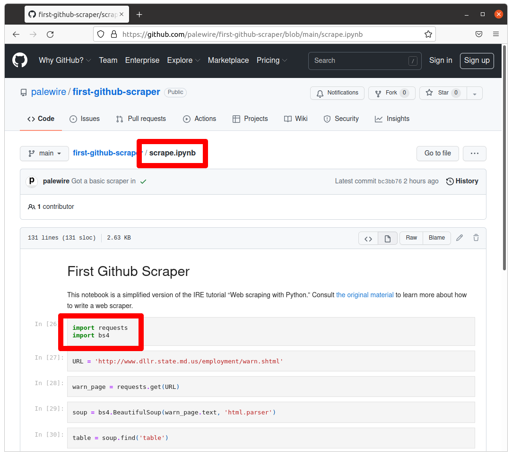

# Scrape data locally 

This chapter will guide you through the process of adding a Python web scraper to your repository.

```{contents} Sections
  :depth: 1
  :local:
```

## Download a scraper

The mechanics of how to devise a web scraper are beyond the scope of this class. Rather than craft our own, we will use the scraper created as part of the [“Ẅeb Scraping with Python”](https://github.com/ireapps/teaching-guide-python-scraping/blob/master/Web%20scraping%20with%20Python.ipynb) class put on by [Investigative Reporters and Editors](https://www.ire.org/). If you'd like to learn more about the scraping process, follow [their tutorial](https://github.com/ireapps/teaching-guide-python-scraping/blob/master/Web%20scraping%20with%20Python.ipynb).


A completed, simplified version of IRE’s scraper is available at [github.com/palewire/first-github-scraper](https://www.github.com/palewire/first-github-scraper/). Open the `scrape.ipynb` file there and click the button labeled "Raw." It will give you the scraper’s [source code](https://raw.githubusercontent.com/palewire/first-github-scraper/main/scrape.ipynb). Save that file into your repository’s root directory as `scrape.ipynb`.

The routine is trained to download [WARN Act](https://en.wikipedia.org/wiki/Worker_Adjustment_and_Retraining_Notification_Act_of_1988) notices [posted](https://www.dllr.state.md.us/employment/warn.shtml) by the state of Maryland’s Department of Labor. The list is updated when companies based in the state disclose a mass layoff. Business reporters frequently use notices like these to report when plants close and workers lose jobs.

```{note}
If you’re interested in getting more involved with tracking WARN Act notices, investigate the [scraping system maintained by Stanford’s Big Local News](https://github.com/biglocalnews/warn-scraper) project. It scrapes filings from dozens of different state websites, consolidating them into a single file. That process is automated via, you guessed it, a [GitHub Action](https://github.com/biglocalnews/warn-github-flow).
```

There are different ways to run and test this scraper. This section will show you how to install Python tools on your computer to run this locally. If you want to learn how to run this notebook without installing them, skip to section 3. 

## Install pipenv

Our web scraper will depend on a set of Python tools that we’ll need to install before we can run the code.

They are the [JupyterLab](https://jupyter.org/) computational notebook, the [requests](https://docs.python-requests.org/en/latest/) library for downloading webpages and [BeautifulSoup](https://beautiful-soup-4.readthedocs.io/en/latest/), a handy utility for parsing data out of HTML.

JupyterLab is required to run the `.ipynb` notebook file. We can tell `requests` and `bs4` will be necessary because they are imported at the top of the script, as seen on GitHub.



By default, Python's third-party packages are installed in a shared folder somewhere in the depths of your computer. Unless told otherwise, every Python project will draw from this common pool of programs.

That approach is fine for your first experiments with Python, but it quickly falls apart when you start to get serious about coding.

For instance, say you develop a web application today with [Flask](https://palletsprojects.com/p/flask/) version 1.1. What if, a year from now, you start a new project and use a newer version of Flask? Your old app is still running and may require occasional patches, but you may not have time to rewrite your old code to make it compatible with the latest version.

Open-source projects are changing every day and such conflicts are common, especially when you factor in the sub-dependencies of your project’s direct dependencies, as well as the sub-dependencies of those sub-dependencies.

Programmers solve this problem by creating a [virtual environment](https://docs.python.org/3/tutorial/venv.html) for each project, which isolates the code into a discrete, independent container that does not rely on the global environment.

Strictly speaking, working within a virtual environment is not required. At first it might even feel like a hassle, but in the long run you will be glad you did it. 

```{note}
You don’t have to take our word for it, you can read discussions on [StackOverflow](https://conda.io/docs/index.html) and [Reddit](https://www.reddit.com/r/Python/comments/2qq1d9/should_i_always_use_virtualenv/).
```

There are several different ways to run a virtual environment. In this tutorial, we will take advantage of [`pipenv`](https://pipenv.kennethreitz.org/en/latest/), a widely used tool that is [recommended](https://packaging.python.org/en/latest/guides/tool-recommendations/) by leaders in the Python community.

Like the commands we've already learned, `pipenv` is executed with your computer’s command-line interface. You can verify it’s there by typing the following into your terminal:

```bash
pipenv --version
```

If you have it installed, you should see the terminal respond with the version on your machine. That will look something like this:

```bash
pipenv, version 2021.11.23
```

If you get an error that says `pipenv` isn’t present, you will need to install it.

If you are on a Mac, the `pipenv` maintainers [recommend](https://pipenv.kennethreitz.org/en/latest/install/#homebrew-installation-of-pipenv) installing via the [Homebrew](https://brew.sh/) package manager, like so:

```bash
brew install pipenv
```

If you are on Windows and using the [Windows Subsystem for Linux](https://docs.microsoft.com/en-us/windows/wsl/install-win10), you can use Homebrew’s cousin [Linuxbrew](https://docs.brew.sh/Homebrew-on-Linux) to install Pipenv.

If neither option makes sense for you, the `pipenv` [documentation](https://pipenv.kennethreitz.org/en/latest/install/#pragmatic-installation-of-pipenv) recommends an [install](https://pip.pypa.io/en/stable/user_guide/#user-installs) via another Python tool, [`pip`](https://pypi.org/project/pip/):

```bash
pip install --user pipenv
```

Whatever installation route you choose, you can confirm your success by asking for the `pipenv` version, as we did above.

```bash
pipenv --version
```

## Install Python tools

Now let's use `pipenv` to install our Python packages. We can add them to our project's virtual environment by typing their names after the `install` command.

```bash
pipenv install jupyterlab requests bs4
```

```{note}
Save yourself some hassle; Copy and paste the command. There’s no shame. It’s the best way to avoid typos.
```

When you invoke the `install` command, `pipenv` checks for an existing virtual environment connected to your project’s directory. Finding none, it creates a new environment and installs your packages into it.

The packages we’ve requested are downloaded and installed from the [Python Package Index](https://pypi.org/), an open directory of free tools. Each of our programs has a page there. For instance, JupyterLab is indexed at [pypi.org/project/jupyterlab](https://pypi.org/project/jupyterlab/). 

When the installation finishes, two files will added to your project directory: `Pipfile` and `Pipfile.lock`. Open them in a text editor and you’ll see how they describe your project’s Python requirements.

In the `Pipfile`, you'll find the name and version of the packages we directed `pipenv` to install. We didn’t specify an exact version, so you’ll see something like:

```
[packages]
jupyterlab = "*"
requests = "*"
bs4 = "*"
```

`Pipfile.lock` has a more complicated, nested structure that specifies the exact version of your project‘s direct dependencies, along with all their sub-dependencies. It’s a complete blueprint for how to install your project on any computer.

## Run the scraper

With your Python tools installed, you’re ready to run the scraper. JupyterLab comes equipped with a special command — `jupyter execute` — that can run any `.ipynb` file from the command line.

Since JupyterLab was installed inside of a `pipenv` virtual environment, you’ll need to invoke it with the `pipenv run` command to access the special container where our programs were installed.

Here's how to do it. Give it a try.

```bash
pipenv run jupyter execute scrape.ipynb
```

Once it finishes, list out the files in your directory with the `ls` command.

```bash
ls
```

You should see a new file named `warn-data.csv` created by the scraper. Open it in the spreadsheet program of your choice. You should see the data from [Maryland’s site](https://www.dllr.state.md.us/employment/warn.shtml) structured and ready to analyze.


## Save to GitHub

Now we'll log our work with [`git`](https://en.wikipedia.org/wiki/Git), a command-line tool that allows us to carefully track changes to files in our repository. It is the open-source technology at the heart of GitHub’s social network and publishing system.

The first command to learn is [`status`](https://git-scm.com/docs/git-status), which prints out a report card on the current state of your repository.

```bash
git status
```

Run it and your terminal should list out the four files we added to the repository. The next step is to instruct `git` to track the new files with the [`add`](https://git-scm.com/docs/git-add) command.

```bash
git add scrape.ipynb
git add warn-data.csv
git add Pipfile
git add Pipfile.lock
```

```{note}
Rather than introduce files one by one, you can add more than one file by using a [wildcard character](https://en.wikipedia.org/wiki/Wildcard_character) in your command. One common shortcut is `git add .`, which will add all of the files in your repository at once.
```

Logging changes also requires using the [`commit`](https://git-scm.com/docs/git-commit) command, which expects a summary of your work after the `-m` flag.

```bash
git commit -m "First commit"
```

````{warning}
If this is your first time using Git, you may be prompted to configure you name and email. If so, take the time now. 

```bash
git config --global user.email "your@email.com"
git config --global user.name "your name"
```

Then run the `commit` command above again.
````

The final step is to syncronize the changes we’ve made on our computer with the copy of the repository hosted on github.com. This is done via the [`push`](https://git-scm.com/docs/git-push) tool. This complicated `git` command requires two inputs.

First, the command asks for the name of the remote repository where you’d like to send your changes. In the parlance of `git`, the default name is `origin`.

Second, you need to provide the [branch](https://en.wikipedia.org/wiki/Branching_(version_control)) of the code you’d like to syncronize. Branching is a tool for maintaining parallel versions of your code within the same respository. We won't get that sophisticated in this tutorial, so you can stick to the default code branch, which is called `main`.

Taking all that into account, the command to push local changes to GitHub is typically the following. Try it. 

```bash
git push origin main
```

Your terminal should log the action, reporting back on its interaction with GitHub. Congratulations. You have made your first code commit. Reload your repository’s page on GitHub to see your handiwork.


Next we'll learn how to create a GitHub Action that can automatically run your scraper every day.