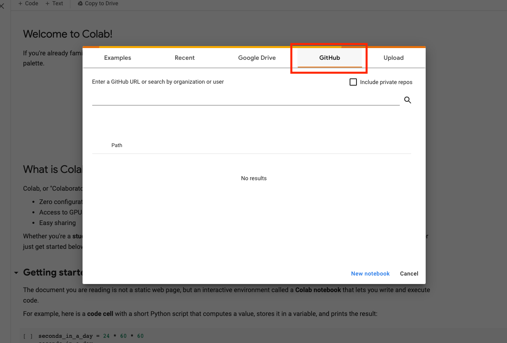
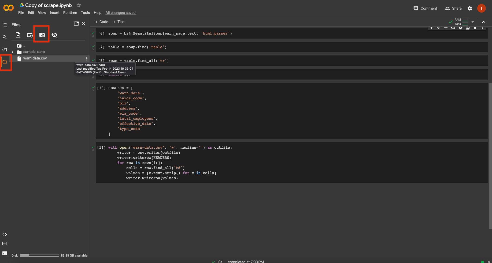

```{include} _templates/nav.html
```

# Scrape data using google collab

This chapter will guide you through the process of adding a Python web scraper to your repository.

```{contents} Sections
  :depth: 1
  :local:
```

## Find the scraper

The mechanics of how to devise a web scraper are beyond the scope of this class. Rather than craft our own, we will use the scraper created as part of the [“Ẅeb Scraping with Python”](https://github.com/ireapps/teaching-guide-python-scraping/blob/master/Web%20scraping%20with%20Python.ipynb) class put on by [Investigative Reporters and Editors](https://www.ire.org/). If you'd like to learn more about the scraping process, follow [their tutorial](https://github.com/ireapps/teaching-guide-python-scraping/blob/master/Web%20scraping%20with%20Python.ipynb).


A completed, simplified version of IRE’s scraper is available at [github.com/palewire/first-github-scraper](https://www.github.com/palewire/first-github-scraper/). 

The routine is trained to download [WARN Act](https://en.wikipedia.org/wiki/Worker_Adjustment_and_Retraining_Notification_Act_of_1988) notices [posted](https://www.dllr.state.md.us/employment/warn.shtml) by the state of Maryland’s Department of Labor. The list is updated when companies based in the state disclose a mass layoff. Business reporters frequently use notices like these to report when plants close and workers lose jobs.

```{note}
If you’re interested in getting more involved with tracking WARN Act notices, investigate the [scraping system maintained by Stanford’s Big Local News](https://github.com/biglocalnews/warn-scraper) project. It scrapes filings from dozens of different state websites, consolidating them into a single file. That process is automated via, you guessed it, a [GitHub Action](https://github.com/biglocalnews/warn-github-flow).
```

## Verify what tools are being used

If you want to run the web scraper locally, we will need to install set of Python tools.

They are the [JupyterLab](https://jupyter.org/) computational notebook, the [requests](https://docs.python-requests.org/en/latest/) library for downloading webpages and [BeautifulSoup](https://beautiful-soup-4.readthedocs.io/en/latest/), a handy utility for parsing data out of HTML.

JupyterLab is required to run the `.ipynb` notebook file. We can tell `requests` and `bs4` will be necessary because they are imported at the top of the script, as seen on GitHub.


By default, Python's third-party packages are installed in a shared folder somewhere in the depths of your computer. Unless told otherwise, every Python project will draw from this common pool of programs.

To run this notebook locally on your computer check out section 2 of this documentation - [Scrape data locally](https://palewi.re/docs/first-github-scraper/scrape-locally.html). Section 2 and 3 are interchangeable - whether you would want to run this locally or on a web browser (which is covered on this section) is up to you.

A simpler way to run a notebook without installing Python and its libraries is to use [Google Collab](https://colab.research.google.com/). Google Collab is a product from Google research that allows you to run python code on your browser - and it's free! It's an easy way to get started on using jupyter notebook without having to install all its requirements.

## Import and the scraper on Google Collab

Make your way to [Goolge Collab](https://colab.research.google.com/) - you will need a google account and sign in. Choose the Github button and add the [link](https://github.com/palewire/first-github-scraper/blob/main/scrape.ipynb) to our scraper. Hit the search button. 



This will open up the notebook on your browser. First, let's make sure to save a copy of this scraper in our google drive. Go to File -> Save a copy in Drive. This will allow you to run the scraper on your collab account without having to search for the GitHub link.


## Run the scraper

Notebooks are comprised of "cells" where you can add your code. You have to execute each line of code in your cell by "running" the cell. You can do this in many ways. Try clicking the play button on the left side of the cell. If you are familiar with Jupyter notebooks, you'll find that keyboard shortcuts like SHIFT + ENTER will work to the cell as well. You can also run the notebook from top to bottom once, by clicking on Runtime --> Run all. Notice our last cell, which creates a warn-data.csv. Click on the folder icon at the bottom of left panel to see your file. 





You should see a new file named `warn-data.csv` created by the scraper. Clicking on the Mount Drive icon on the top of the folder panel will create a new cell in your notebook. If you run the cell, it will create a link to your google drive and allow you to drag your output into drive. You can also download the csv to your computer by right clicking on the csv file. 


Open it in the spreadsheet program of your choice. You should see the data from [Maryland’s site](https://www.dllr.state.md.us/employment/warn.shtml) structured and ready to analyze.
